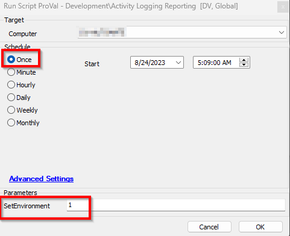

## Purpose

This solution performs the user login/logout activity audit. By default, the script will audit the last 24 hours of data and replace any existing duplicates if it sees existing data so the script should be scheduled at a quicker interval than 24 hours to give a little buffer to ensure there is no missed data. 

## Associated Content

| Content                                                                 | Type      | Function                                                   |
|-------------------------------------------------------------------------|-----------|------------------------------------------------------------|
| [Activity Logging Reporting [DV, Global]](https://proval.itglue.com/DOC-5078775-13392962) | Script    | This script is used to perform the audit of the login/logout of the users. |
| [User Activity Audit [Script]](https://proval.itglue.com/DOC-5078775-13392885)         | Dataview  | The dataview shows the login/logout audit of the users.   |
| [pvl_login_logout_audit](https://proval.itglue.com/DOC-5078775-13392964)               | Table     | This table stores the User login/logout data.             |

## Implementation

- Import the script [Activity Logging Reporting [DV, Global]](https://proval.itglue.com/DOC-5078775-13392962) 
- Import the dataview [User Activity Audit [Script]](https://proval.itglue.com/DOC-5078775-13392885) 
- Run the script once by putting the User Parameter value 'SetEnvironment' to 1 as shown below:  
    
  This will create the table and also create the system property 'ProVal_UserLogIn_Out_Threshold_Days' with the global parameter value 'DataRetention_Threshold' in days provided in the script for performing the data retention. (Defaults to 90 days retention)
- Then schedule the script to the Windows machines.  

**NOTE:** This script is not suitable to run on the DC servers to avoid the noise of multiple user login/logout traces in the system event log as well as in the DB table.
- The DC server is excluded from the script for execution.

