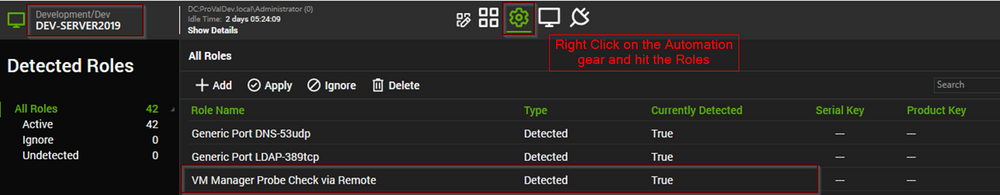
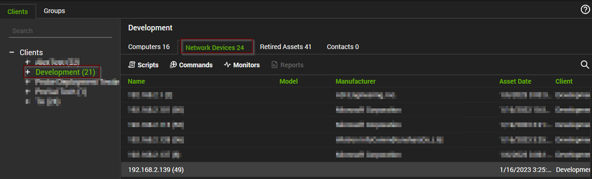
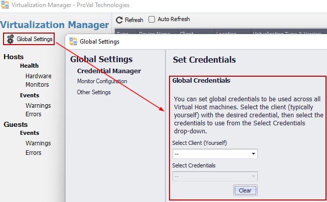
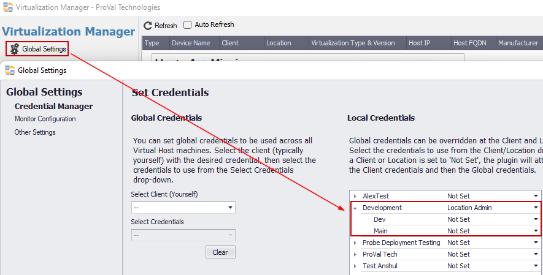
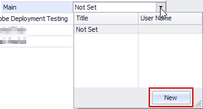
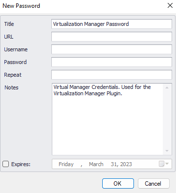
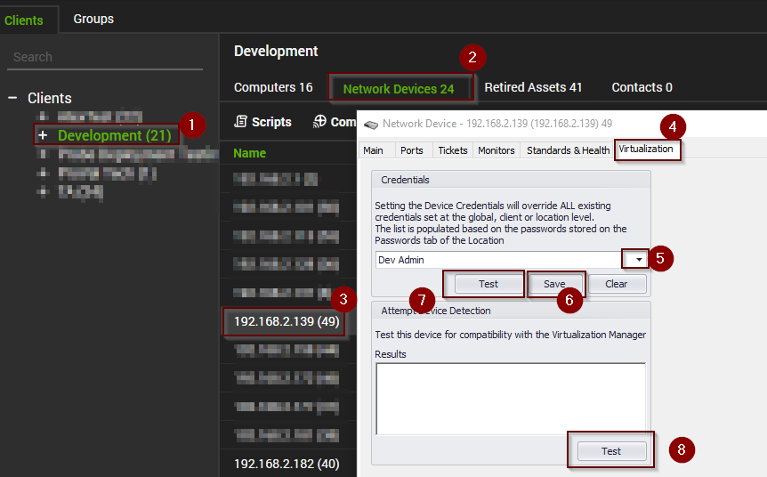
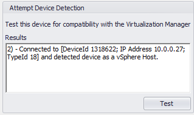

\

The document will help in finding the incorrect configuration that can cause the VMware host detection to fail as well as explains the resolution for each of those areas.

### Probe Configuration

1. Verify a network probe is configured on the same IP subnet where the VMware host resides. Refer to the [Enabling the Network Probe](https://docs.connectwise.com/ConnectWise_Automate_Documentation/070/175/020) article for more information.
2. Confirm that the probe machine has the **VM Manager Probe Check via Remote** role detected.  
   If you do not see this role, run the following commands on the probe machine:
   - Update Config
   - Resend System Info
   - Update Plugins

3. Confirm that the VMware host's IP address appears under the **Network Devices** under the client in the **Control Center**.

4. If it does not, correct the IP range being scanned by the probe from the **Network Probe** tile > **Settings**. Once these settings have been modified, click **Save** and then click **Rescan Network**.

### Credential Configuration

5. Confirm that you have configured the proper credentials for the VMware host. This can be done from the **Global Settings**.

The Global Credentials are if you have an ESXi Password that you share between multiple clients (Not Recommended).

The other option (Recommended), is to manually set the credentials through the Local Credentials section and select the proper password from the client or location:

If you do not have credentials saved at the client or location, you can add them with a quick shortcut when you hit the dropdown and select new credential:

   
If the above steps are fine please check the below steps:

1. From the Control Center, open the Computer Management Screen of the Probe agent and open the File Explorer and look for the *C:/Windows/LTSVC/Plugin_VM.txt* log file on the probe machine.
2. Verify that the VMware host is being scanned. If the IP address does not appear in the log, refer to the above section on **Probe Configuration**.
3. Check for an error message similar to the one below associated with the IP address of your VMware host:  
   *The underlying connection was closed: An unexpected error occurred on a send.....InnerException: Authentication failed because the remote party has closed the transport stream. This indicates that you must modify the ciphers allowed on the VMware host.*

   **Note:** Once you have modified the host, you must re-run the network probe detection. This can be done by restarting the LabTech service on the probe machine. Go to the **Services** tile of the **Computer Management** screen, right-click on the **LTService**, and select **Restart**.

4. Try to manually apply the credentials to the network device itself and run a test through the network device.

If none of the above steps help, please reach out to us at [Support@provaltech.com](mailto:Support@provaltech.com)

