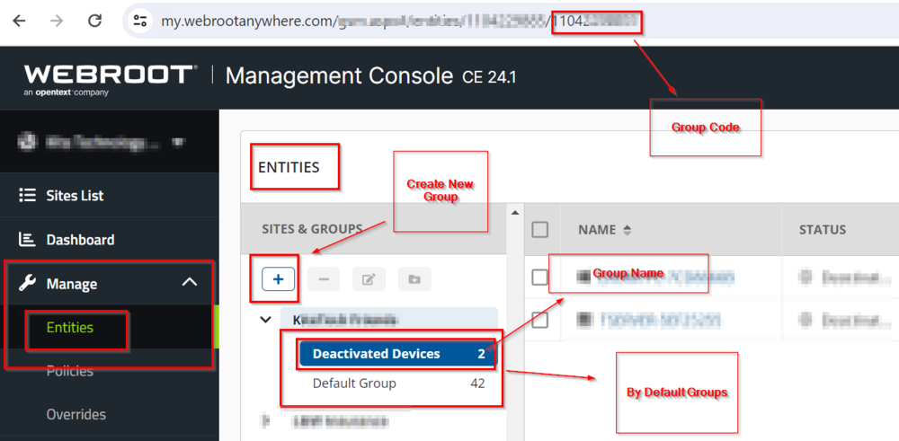

## Step 1: Login to the Webroot Portal

## Step 2: Manage Entities

Go to **Manage → Entities → Sites & Groups** and select the group whose code and name are needed.

Here, you can create a custom group and obtain the code necessary to push installed Webroot agents to that group.

