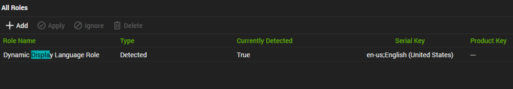

## Summary

This role shows the language used when displaying text in programs that do not support Unicode.

## Settings

| Detection String                                                                                                                                                                            | Comparator | Result                             | Applicable OS |
|---------------------------------------------------------------------------------------------------------------------------------------------------------------------------------------------|------------|------------------------------------|----------------|
| \ | Exists     | en-us;English (United States)      | Windows        |

## Uses

This is helpful to be used in a solution that has dependencies on the system output of a program execution like PowerShell/shell, etc. For example, in the United States, the date format is “MM/DD/YYYY,” while in many European countries, it’s “DD/MM/YYYY.” The system locale setting is designed to accommodate these differences.

## Sample

