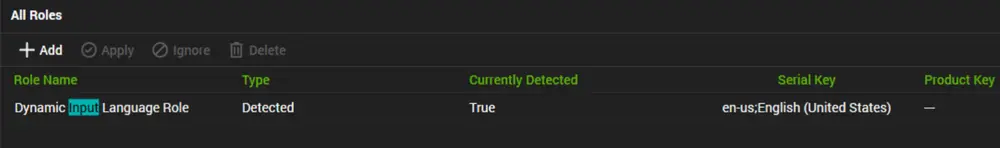

## Summary

This document explains how Windows determines the input system settings, such as keyboard language.

The input language setting determines the layout of the keyboard. For example, an English (United States) input locale will have a QWERTY layout, while a French (France) input locale will use an AZERTY layout. This allows you to type in a language different from the display language used by your operating system.

For instance, if your system locale is set to English (United States) and your input locale is set to French (France), your system will display text in English, but you will be typing using a French keyboard layout. This scenario is common on multilingual systems or when users prefer a keyboard layout different from the default layout of their system language.

## Settings

| Detection String                                                                                                                                               | Comparator | Result                           | Applicable OS |
|----------------------------------------------------------------------------------------------------------------------------------------------------------------|------------|----------------------------------|----------------|
| \\\{@%C:/Windows/System32/WindowsPowerShell/v1.0/powershell.exe -ExecutionPolicy Bypass -Command \"$locale = (systeminfo | findstr /B /C:'Input Locale') -replace 'Input Locale:',''; $locale.trim()\"@%} | Exists     | en-us;English (United States)   | Windows        |

## Sample

