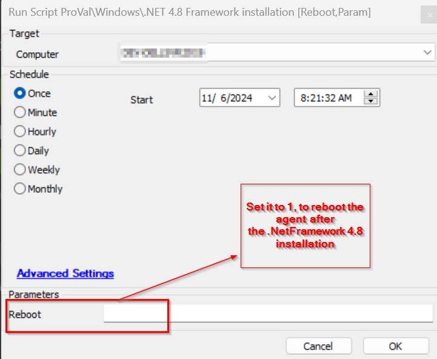

## Summary

The script will check the version of .NET i.e. if 4.8 is not installed on the machine it will install it. It will also REBOOT the machine after the installation if the Reboot parameter is set to 1 for complete installation.

## Sample Run

## Variable

| Name              | Description                                               |
|-------------------|-----------------------------------------------------------|
| FrameWorkStatus    | This stores the .Net Framework 4.8 installation status.  |

#### User Parameters

| Name    | Example | Required | Description                                                                                      |
|---------|---------|----------|--------------------------------------------------------------------------------------------------|
| Reboot  | 1       | False    | If this is set to 1, then the agent will be restarted for the complete installation of the .Net Framework 4.8. |

## Output

- Script log

