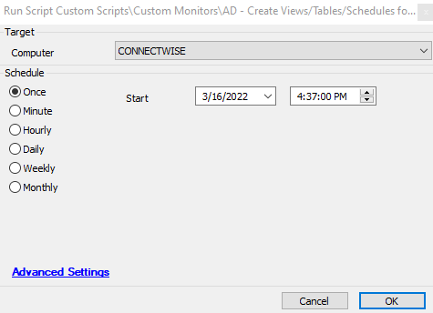

## Summary

This document outlines the creation of all necessary items in the database to ensure the [Active Directory Reporting Solution](<../reports/Active Directory Reporting Solution.md>) functions correctly. This script will create the following items:

1. Table: `plugin_proval_ad_pwd_audit`
2. View: `plugin_proval_ad`
3. View: `plugin_proval_ad_compliance`
4. View: `plugin_proval_ad_groups`
5. View: `plugin_proval_ad_pcinv`
6. Schedules the script [RSM - Active Directory - Script - Weak Passwords - AD Test](<./Weak Passwords - AD Test.md>) on the Domain Controllers group, limited by the Infrastructure Masters search.

## Sample Run

## Dependencies

There are two prerequisites that need to be installed for this script to function correctly:

1. Script Added to Environment: [AD - Test for Weak Passwords](https://proval.itglue.com/DOC-5078775-9492875)
2. The Active Directory Plugin needs to be installed and configured.

Other items depend on this script being executed to function, which are listed below:

1. [Report - Active Directory User Assessment](<../reports/Active Directory User Assessment.md>)
2. [Report - Active Directory User Groups - Detail](https://proval.itglue.com/DOC-5078775-9493130)
3. Report - Computers in Active Directory - No Agent

## Output

This is a one-time use script, used to install/create a table, four views, and schedule a script. After running it once, this script can be removed from the environment.

