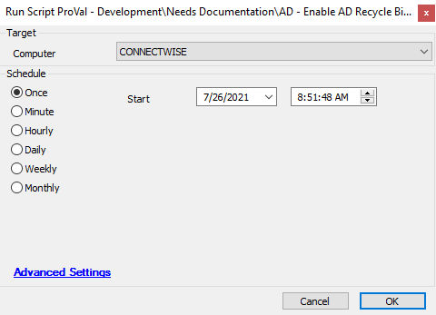

## Summary

This script enables the AD Recycle Bin. [Microsoft TechNet Article](https://techcommunity.microsoft.com/t5/ask-the-directory-services-team/the-ad-recycle-bin-understanding-implementing-best-practices-and/ba-p/396944)  
**Note:** Once you enable the Active Directory Recycle Bin, you cannot turn it off.

**Time Saved by Automation:** 10 Minutes

## Sample Run

## Dependencies

[AD Recycle Bin State Check](<../monitors/AD Recycle Bin State Check.md>)

## Process

- This script will ensure the Windows OS is not older than 2008 R2.
- It will further ensure that the Windows domain and forest mode are not older than 2008 R2.
- If both conditions are true, then it will enable the AD Recycle Bin.

## Output

- Script Log
- Ticketing

## Ticketing

**Subject:** `The AD Recycle Bin failed to be enabled on the DC server %computername% (ID: %computerid%) of Client: %clientname% (ID: %clientid%)`  

**Ticket Body:** `The AD Recycle Bin failed to be enabled on the DC server %computername% (ID: %computerid%) of Client: %clientname% (ID: %clientid%). The AD Recycle Bin failed to enable due to a permission issue.`  
**Logs:**  
`@Output@`  

The PC information is outlined below:  
**PC Name:** %computername%  
**Last Login:** %lastuser%  
**PC Model:** @biosname@  
**OS:** %os%  
**S/N of PC:** @biosver@  

### If Not Enabled

`The AD Recycle Bin failed to be enabled on the DC server %computername% (ID: %computerid%) of Client: %clientname% (ID: %clientid%). The OS is supportable, Domain Mode/Forest Mode is suitable, and PowerShell version is also acceptable, but still, the enabling of the Recycle Bin failed. Please have a look.`  
**Logs:**  
`@Output@`  

### Not Eligible

`The AD Recycle Bin failed to be enabled on the DC server %computername% (ID: %computerid%) of Client: %clientname% (ID: %clientid%). The Domain Mode or Forest Mode is not eligible for the AD Recycle Bin to be enabled.`  

### Not Supported

`The AD Recycle Bin failed to be enabled on the DC server %computername% (ID: %computerid%) of Client: %clientname% (ID: %clientid%). The OS is not eligible for the AD Recycle Bin to be enabled. The minimum OS requirement is 2008 R2, whereas the current OS is %os%.'`  

### Outdated

`The AD Recycle Bin failed to be enabled on the DC server %computername% (ID: %computerid%) of Client: %clientname% (ID: %clientid%). The PowerShell version is outdated. The minimum version required is above 3.0, and the current version is @PSVersion@.`  

