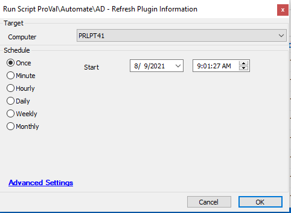

## Summary

This script will reset the AD plugin for the DC it runs on.

Time Saved by Automation: 5 Minutes

## Sample Run

## Process

- Runs LabTech Command 13 to reset the AD plugin on the DC
- Run another LabTech command "update plugins" to synchronize plugin data on the agent.

