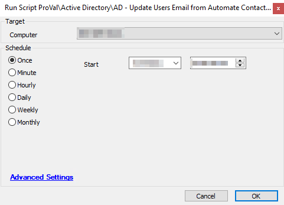

## Summary

This script is designed to update AD users whose email addresses have not been entered to match, by name, with contacts in Automate. The purpose is related to user-centric billing so that email addresses can be used to sync users based on the email field.  
**Time Saved by Automation:** 5 Minutes

## Sample Run

**Target:** Domain Controllers  


## Dependencies

If billing in CW Manage is not being performed via user-centric methods, this script may not provide any benefits.

## Variables

- `@LoopCounter@` - This variable is used as part of the SQL data loop that will gather the data by user so it can be inserted into AD.
- `@SQLName@` - This variable is determined by the SQL query in the scripting loop and is the first and last name of the target user account that will have its email address updated.
- `@sqlemail@` - This variable is determined by the SQL query in the scripting loop and is the email address that will be pushed into the user's AD account.

## Process

This script is targeted for Domain Controllers only! The initial check will cause the script to fail if it is not run against a Domain Controller.

The script will first start a SQL scripting loop and gather data by running the SQL query:

```
SELECT contactid, CONCAT(firstname, ' ', lastname) AS name, email FROM contacts WHERE email != '' AND clientid = %clientid%
```

This query will grab the ContactID, the first and last name, and the email address of contacts in Automate, provided the contact isn't missing an email address and the client ID of the contact matches the client ID of the domain controller in Automate.

From there, the script will go user account by user account and fill out the email address field in AD. The script then runs the following PowerShell:

```
Import-Module ActiveDirectory; Get-ADUser -Filter 'Name -like "@sqlname@"' | Set-ADUser -EmailAddress "@sqlemail@"
```

This PowerShell command will import the AD module if it is not already present, retrieve the user's first and last name, and then set the user's email address based on the earlier SQL query.

The script will then verify if there were any errors during the PowerShell run; it will log the information in the error log or exit with success.  
**NOTE:** The script will continue after an error and attempt to update the next record in the SQL loop.

## Output

Script log messages only.


