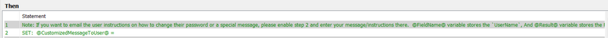
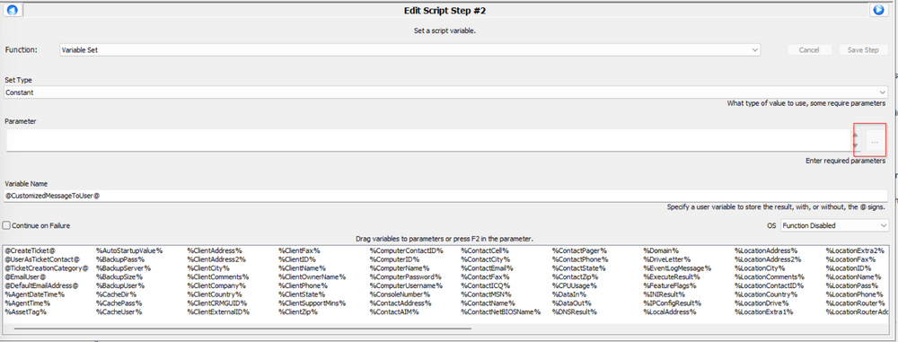
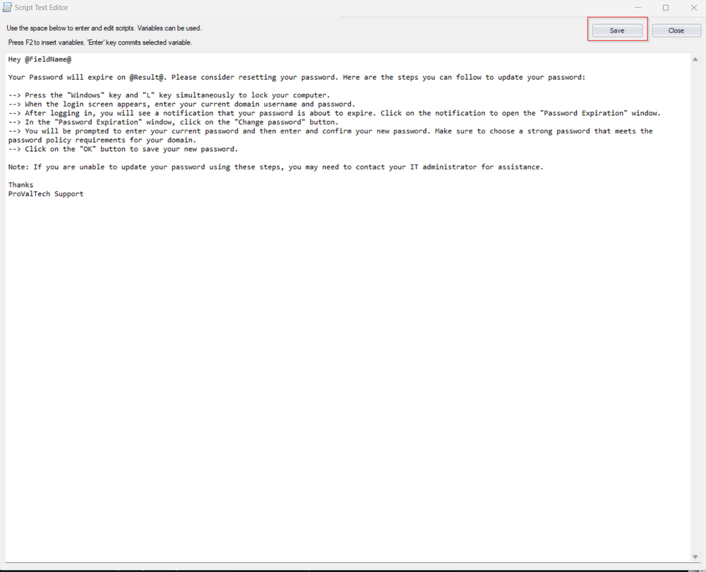
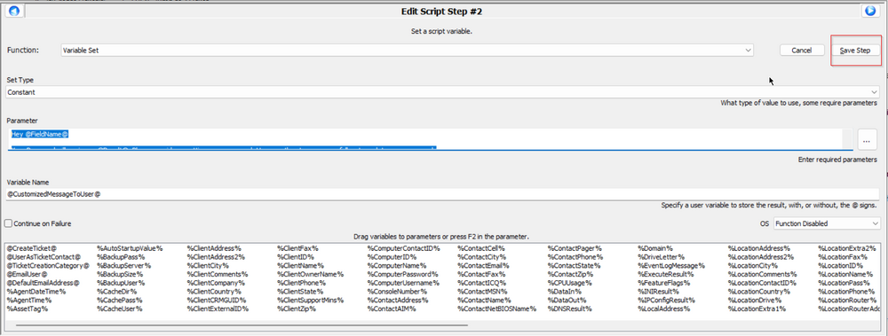
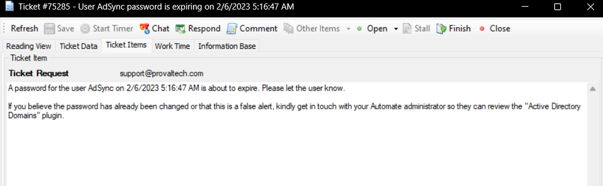
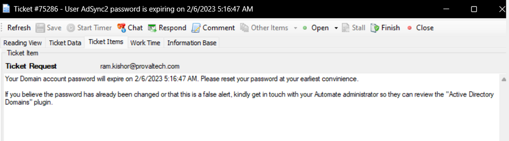
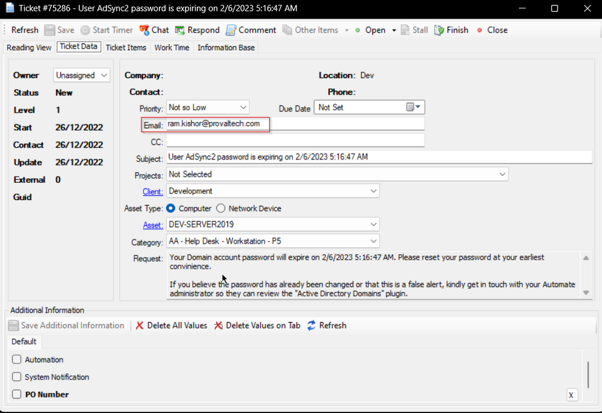
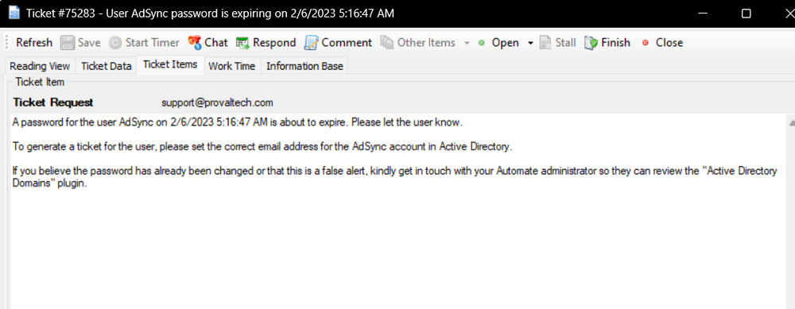
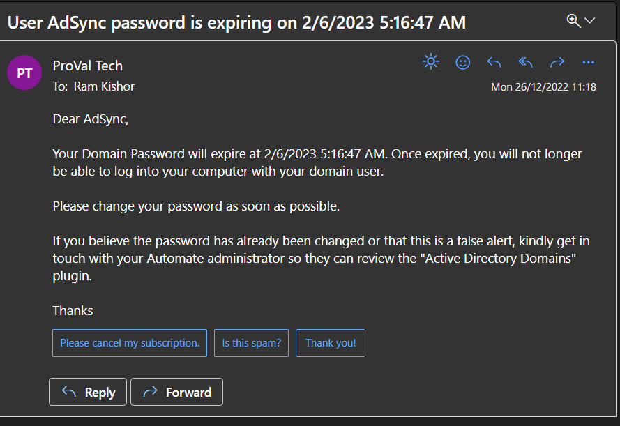
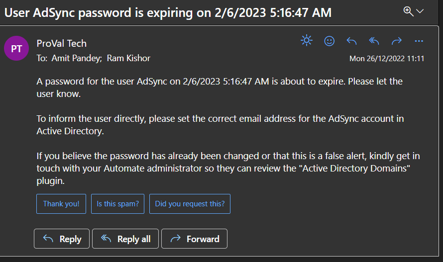

## Summary

The script covers the alerting section of the [Password Expires This Week [G]](https://proval.itglue.com/DOC-5078775-8041377) monitor set. Various options for alerting can be configured from Global Variables.

**Note:** The contact must be present in CW Manage to associate with the ticket.

## Update Notice: 2-October-2024

The script has been modified to send the `Password Compliance Info` to the Tickets and Emails.

**Content added to Emails and Tickets:**

```
Password Compliance Info

Maximum Password Age: <Max Password Age>
Minimum Password Length: <Password Length Requirement>
Password History Remembered: <Number of remembered passwords>
Password Complexity: <Is Complexity Required?>
```

**Examples:**

```
Password Compliance Info

Maximum Password Age: Unlimited
Minimum Password Length: No Length Requirement
Password History Remembered: None
Password Complexity: No Complexity Required
```

```
Password Compliance Info

Maximum Password Age: 90 Days
Minimum Password Length: 16 Characters
Password History Remembered: 6 Passwords Remembered
Password Complexity: Complexity Required
```

## Special Instructions

If you want to email the user instructions on how to change their password or a special message, please enable step 2 and enter your message/instructions there. `@FieldName@` variable stores the `UserName`, and the `@Result@` variable stores the Password Expiration Date.



Step Wise instructions:

Right-Click on Step 2, and select Enable Function.  
Double-Click on Step 2, and click on the three dots (...) at the right side of the Parameter Box.



A Box will pop up (Script Text Editor). Now, type your message/instructions in the box and press Save.  
e.g.,



This will close the Text Editor. Press save.



Now Save the script by clicking on the `Save` button at the bottom right.

## Sample Run

It is an Autofix script to be executed via `△ Custom - Password Expiration Notification` alert template.

## Dependencies

[RSM - Active Directory - Monitor - Password Expires This Week [G]](https://proval.itglue.com/DOC-5078775-8041377)

## Variables

| Name                     | Description                                                                                         |
|--------------------------|-----------------------------------------------------------------------------------------------------|
| STATUS                   | Status returned by the monitor set. (SUCCESS/FAILED)                                              |
| Subject                  | Ticket/Email Subject.                                                                               |
| EmailAddress             | Email Address of the user or email address of the default contact of computer/location/client if the user account does not have any email address. |
| Body                     | Ticket/Email Body.                                                                                 |
| Ticid                    | Ticketid of existing ticket to comment, instead of creating a new ticket each run.                |
| CustomizedMessageToUser  | Customized Messages/Instructions to the user to update their password, if any.                    |

#### Global Parameters

| Name                     | Default | Required | Description                                                                                         |
|--------------------------|---------|----------|-----------------------------------------------------------------------------------------------------|
| CreateTicket             | 1       | False    | 1 or 0 to toggle between ticket creation function of the script.                                   |
| UserAsTicketContact      | 1       | False    | For 1 script will set the user account as the contact for the ticket in CW Manage. For 0 it will use the default contact of computer/location/client. |
| TicketCreationCategory    | 0       | False    | Change the ticket creation category to set a specific service board and priority to the ticket. If it's set to 0 then script will fetch the ticket category from the Monitor set, and then will use the default ticket category if it's not defined for the monitor set too. |
| EmailUser                | 0       | False    | 1 to directly email user about their password getting expired, 0 to disable this feature           |
| DefaultEmailAddress      |         | True (Only if EmailUser= 1) | Email address to Email, if the concerned user does not have any email address associated and the computer/location/client does not have any default contact set. Multiple emails must be separated by a semicolon. e.g., [abc@def.com](mailto:abc@def.com); [ghi@jkl.com](http://%3Bghi@jkl.com); [mno@pqr.com](http://%3Bmno@pqr.com) |

## Process

Check the configuration of Global Variables and act accordingly.

1. For CreateTicket = 1 and UserAsTicketContact = 0
   1. Set the Subject Line.
   2. Set the ticket creation category.
   3. Set the ticket body.
   4. Create a ticket for the default computer/location/client contact.
  
2. For CreateTicket = 1 and UserAsTicketContact = 1
   1. Check whether the user has an email address associated or not, because to set the contact in CW Manage ticket, email address is a must.
   2. For User account not having any email address:
      1. Set the ticket body with a message to the network admin as the ticket will be created for the default computer/location/client contact.
      2. Create a ticket.
   3. For User accounts having email address:
      1. Set the ticket body with a message addressing the users themselves.
      2. Create a ticket with the user account as a contact.

3. For EmailUser = 1
   1. Set the Subject Line.
   2. Check whether the user has an email address associated or not.
   3. For User account not having any email address:
      1. Check whether there is a default contact associated with Computer/Location/Client or not. If not then Check the Email address defined into DefaultEmailAddress.
         1. If email address is found then set the email body with a message to the network admin to have the user reset their password.
         2. If email address is not found not even under the DefaultEmailAddress variable then write an error log and exit.
   4. For User accounts having email address:
      1. Set the email body with a message addressing the users themselves.
      2. Send the email to the user's email address, asking them to change their password.

## Output

- Script Log
- Ticket
- Email

## Ticketing

```
Ticketing depends on the configuration of the Global Variables. 
```

For CreateTicket= 1 and UserAsTicketContact= 0

```
Subject: User <UserName> password is expiring on <Expiry Date>
Body: A password for the user <UserName> on <Expiry Date> is about to expire. Please let the user know.

If you believe the password has already been changed or that this is a false alert, kindly get in touch with your Automate administrator so they can review the "Active Directory Domains" plugin.
```

Sample: 


For CreateTicket= 1 and UserAsTicketContact= 1 And User does have an Email address.

```
Subject: User <UserName> password is expiring on <Expiry Date>
Body: Your Domain account password will expire on <Expiry Date>. Please reset your password at your earliest convenience.

If you believe the password has already been changed or that this is a false alert, kindly get in touch with your Automate administrator so they can review the "Active Directory Domains" plugin.
```

Sample: 
  
A screenshot showing user's email address added to the ticket, as this email will be setting the ticket contact in CW Manage.  


For CreateTicket= 1 and UserAsTicketContact= 1 And User does not have any email address.

```
Subject: User <UserName> password is expiring on <Expiry Date>
Body: A password for the user <UserName> on <Expiry Date> is about to expire. Please let the user know.

To generate a ticket for the user, please set the correct email address for the @fieldname@ account in Active Directory.

If you believe the password has already been changed or that this is a false alert, kindly get in touch with your Automate administrator so they can review the "Active Directory Domains" plugin.
```

Sample: 


## Emailing

```
Emailing can be enabled by setting the global variable EmailUser = 1 
```

For EmailUser = 1 and User does have an email address 

```
Subject: User <UserName> password is expiring on <Expiry Date>
Body: 
Dear <UserName>,
Your Domain Password will expire at <Expiry Date>. Once expired, you will no longer be able to log into your computer with your domain user.
Please change your password as soon as possible.

If you believe the password has already been changed or that this is a false alert, kindly get in touch with your Automate administrator so they can review the "Active Directory Domains" plugin.

Thanks
```

Sample: 


For EmailUser = 1, User does not have an email address, and defaultemailaddress is set.

```
Subject: User <UserName> password is expiring on <Expiry Date>
Body: A password for the user <UserName> on <Expiry Date> is about to expire. Please let the user know.
To inform the user directly, please set the correct email address for the @fieldname@ account in Active Directory.

If you believe the password has already been changed or that this is a false alert, kindly get in touch with your Automate administrator so they can review the "Active Directory Domains" plugin.
```

Sample: 



