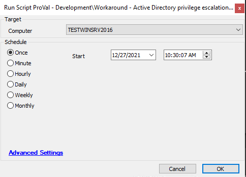

## Summary

The script is created to verify the installation of all the necessary patches in order to mitigate and detect Active Directory privilege escalation attacks. Apart from this, it is looking for computer accounts with non-compliant sAMAccountName and is also ensuring the presence of the `HKEY_LOCAL_MACHINE/System/CurrentControlSet/Services/Kdc/PacRequestorEnforcement` registry key with value 1.

**Intended Target:** Domain Controllers  
**Time Saved by Automation:** 30 Minutes.

## Sample Run

## Dependencies

[Workaround - Active Directory privilege escalation attack [SCRIPT]](https://proval.itglue.com/DOC-5078775-8930310)

## Variables

- `@Output@`: Stores the PowerShell result of the PowerShell script verifying the installation of concern patches.
- `@Missing_Patches@`: KBID of the superseded patches that need to be installed on the concerned computer.
- `@ncsam@`: Stores the names of the computer accounts with non-compliant sAMAccountName.

## Process

**Step 1:** The script will check for the installation of the patches needed in order to stop/restrict Active Directory privilege escalation attacks.  
With the release of a superseded version of each patch, we may need to keep updating the script in order to account for those as well. Currently, it is looking for the following patches and one patch from each line is supposed to be installed for the concerned Operating System:

- [KB5008263](https://support.microsoft.com/en-us/topic/december-14-2021-kb5008263-monthly-rollup-513a39f5-b624-4214-b2be-b93f5a775e12), [KB5007247](#): Server 2012 R2  
- [KB5008277](https://support.microsoft.com/en-us/topic/december-14-2021-kb5008277-monthly-rollup-f6678266-b1fb-474e-9cf1-cf60fa8faa54), [KB5007260](https://support.microsoft.com/en-us/topic/november-9-2021-kb5007260-monthly-rollup-eea1738a-38d1-424b-8d73-d9e30ce28e1a): Server 2012  
- [KB5008244](https://support.microsoft.com/en-gb/topic/december-14-2021-kb5008244-monthly-rollup-d128e47c-8828-4f0d-9d30-571bb1bc1c5f), [KB5007236](https://support.microsoft.com/en-gb/topic/november-9-2021-kb5007236-monthly-rollup-bb3700cd-168a-4834-a517-35bd43498b7d): Server 2008 R2  
- [KB5008274](https://support.microsoft.com/en-gb/topic/december-14-2021-kb5008274-monthly-rollup-e7eed5a2-1154-4af6-a3ec-1db61d66f967), [KB5007263](https://support.microsoft.com/en-gb/topic/november-9-2021-kb5007263-monthly-rollup-cbefd1e8-7bdc-4a3f-98f5-7d9f20e5fa0b): Server 2008  
- [KB5008207](https://support.microsoft.com/en-gb/topic/december-14-2021-kb5008207-os-build-14393-4825-35421e45-96b3-4585-9faa-02576d813e7a), [KB5008601](https://support.microsoft.com/en-gb/topic/november-14-2021-kb5008601-os-build-14393-4771-out-of-band-c8cd33ce-3d40-4853-bee4-a7cc943582b9), [KB5007192](https://support.microsoft.com/en-gb/topic/november-9-2021-kb5007192-os-build-14393-4770-f534a33a-ed00-4bd2-8248-9424c53e9bde): Server 2016  
- [KB5008218](https://support.microsoft.com/en-gb/topic/december-14-2021-kb5008218-os-build-17763-2366-0d9c500d-6e71-4cb4-99e2-416655622769), [KB5008602](https://support.microsoft.com/en-gb/topic/november-14-2021-kb5008602-os-build-17763-2305-out-of-band-8583a8a3-ebed-4829-b285-356fb5aaacd7), [KB5007206](https://support.microsoft.com/en-gb/topic/november-9-2021-kb5007206-os-build-17763-2300-c63b76fa-a9b4-4685-b17c-7d866bb50e48): Server 2019  
- [KB5007255](https://support.microsoft.com/en-gb/topic/november-9-2021-kb5007255-security-only-update-10532701-72af-4061-a138-a5f85685eef9): Server 2012 R2  
- [KB5007245](https://support.microsoft.com/en-gb/topic/november-9-2021-kb5007245-security-only-update-f1e7ded4-9dfb-4625-8d34-70d8c1d42eda): Server 2012  
- [KB5007233](https://support.microsoft.com/en-gb/topic/november-9-2021-kb5007233-security-only-update-4276b400-6317-4e0c-a830-ac375aec983c): Server 2008 R2  
- [KB5007246](https://support.microsoft.com/en-gb/topic/november-9-2021-kb5007246-security-only-update-99e6a0cc-f6cc-4887-9219-021707060ebb): Server 2008  

**Step 2:** It will add the KBID of the compulsory and missing updates to the "Missing Patches" EDF of the concerned computer.

**Step 3:** Then it will check for the status of the `HKEY_LOCAL_MACHINE/System/CurrentControlSet/Services/Kdc/PacRequestorEnforcement` registry key and will add/update the registry key if the value is already not set to 1 or 2.

**Step 4:** In the end, it will check for the potentially vulnerable Computer Accounts and update those names in the EDFs.

The script will save information to the following EDFs based on the output of the script:
- KB5008602 Status
- KB5008380 Status
- KB5008102 Status
- Missing Patches
- CVE-2021-42287 Workaround
- Non-compliant sAMAccountName
- non-compliant UAC sAMAccountType
- Information Update Time

These EDFs are also presented in the dataview [Workaround - Active Directory privilege escalation attack [SCRIPT]](https://proval.itglue.com/DOC-5078775-8930310) Dataview.

## Output

- Extra Data Fields
- Dataview

