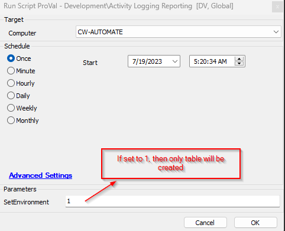

## Summary

This script is used to perform the audit of the login/logout of the users.

## Sample Run

## Dependencies

[pvl_login_logout_audit](<../tables/pvl_login_logout_audit.md>)

## Variables

Document the various variables in the script. Delete any section that is not relevant to your script.

| Name           | Description                                                                                                                                                                |
|----------------|----------------------------------------------------------------------------------------------------------------------------------------------------------------------------|
| Threshold      | This stores data from property 'ProVal_UserLogIn_Out_Threshold_Days' to set the data deletion threshold for older data than the provided value.                          |
| Retention      | It shows whether the threshold system properties value was provided or not and based on data deletion proceed.                                                             |

#### Global Parameters

| Name                | Example                     | Required | Description                                                                                                                                                                                                                                           |
|---------------------|-----------------------------|----------|-------------------------------------------------------------------------------------------------------------------------------------------------------------------------------------------------------------------------------------------------------|
| TableName           | pvl_login_logout_audit      | True     | This denotes the name of the table created to store the activity login/logout data. Note: It should not be changed without notifying ProVal DevOps team, else the dataview and solution will break.                                           |
| Hours               | 24                          | True     | Required to trace the user activity of the past 1 hour.Note: Value can be changed and should correlate with the monitor interval to get appropriate data.                                                                                     |
| Data_Deletion       | 1                           | False    | 1 - If set to 1, then the table pvl_login_logout_audit older data will start getting truncated based on the system property 'ProVal_UserLogIn_Out_Threshold_Days' value.0 - No data deletion will be performed.                            |
| AuditEvent_Enable   | 1                           | False    | 1 - If set to 1, then the script will enable the Audit login/logout local policy on the agent for data collection in the event logs.0 - The Audit local policy will not be enabled by the script.Note: By default, the policy is not enabled in the agent. |
| DataRetention_Threshold | 90                     | False    | The value is set in days.If the value provided and the Data_Deletion is set to 1, then the older data in the table [vl_login_logout_audit](<../tables/pvl_login_logout_audit.md>) will be deleted by the provided value of this parameter.  |

#### User Parameters

| Name              | Example | Required | Description                                                                                                                                                                                                                   |
|-------------------|---------|----------|-------------------------------------------------------------------------------------------------------------------------------------------------------------------------------------------------------------------------------|
| SetEnvironment     | 1       | False    | If it is set to 1, then only the table will be created.0 - The script will execute completely and will collect the user login/logout audit data.                                                                          |

#### System Properties

| Name                                    | Example | Required | Description                                                                                                 |
|-----------------------------------------|---------|----------|-------------------------------------------------------------------------------------------------------------|
| ProVal_UserLogIn_Out_Threshold_Days    | 365     | True     | This value helps to get the data deleted older than the provided days in this property.                     |

## Output

- Script log
- Dataview

