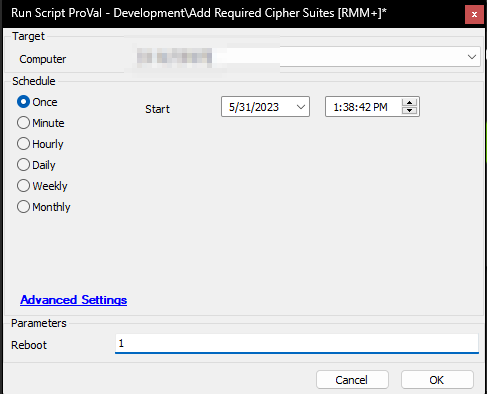

## Summary

The goal of this script is to add the [Cipher Suites](https://docs.connectwise.com/ConnectWise_Automate_Documentation/080/050/Agent_TLS_1.2_Support_Assessment#:~:text=via%20TLS%201.2.-,Supported,-Cipher%20Suites) needed for an Automate agent to sign up with Automate. It also enables TLS 1.2 before adding the cipher suites.

## Sample Run

## Dependencies

[CWM - Automate - RMM+ Plugin Configuration](<./CWM - Automate - RMM+ Plugin Configuration.md>)

## Variables

| Name          | Description                                                                                     |
|---------------|-------------------------------------------------------------------------------------------------|
| Online        | Status of the computer in the Screenconnect portal. 1 for Online, and 0 for Offline           |
| Command       | Command to execute to set cipher suites                                                        |
| UnparsedOutput| Output of the command returned by the plugin                                                   |
| ParsedOutput  | Output of the command after removing unnecessary characters.                                    |

### User Parameters

| Name    | Example | Required | Description                                                                                                           |
|---------|---------|----------|-----------------------------------------------------------------------------------------------------------------------|
| Reboot  | 1       | False    | Set it to 1 to restart the computer after introducing/adding the cipher suites. The computer needs to reboot to implement the changes. Ignore this variable if you will be rebooting the computer later manually. |

## Output

Script Log

