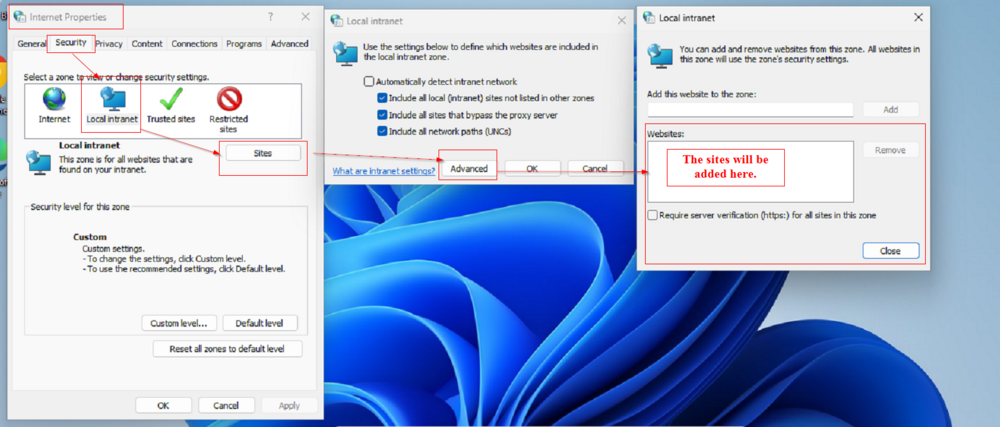
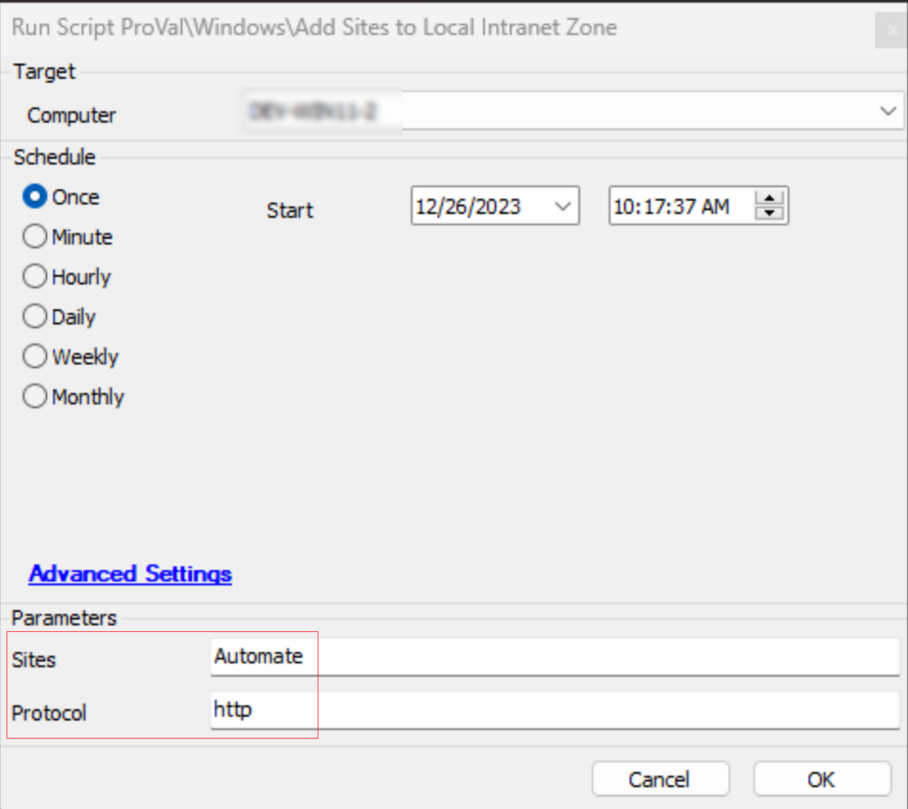
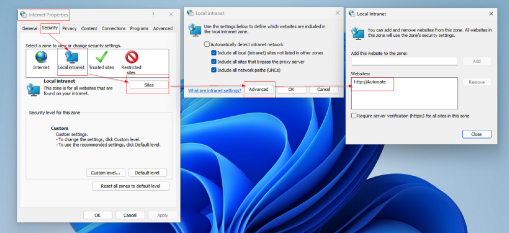
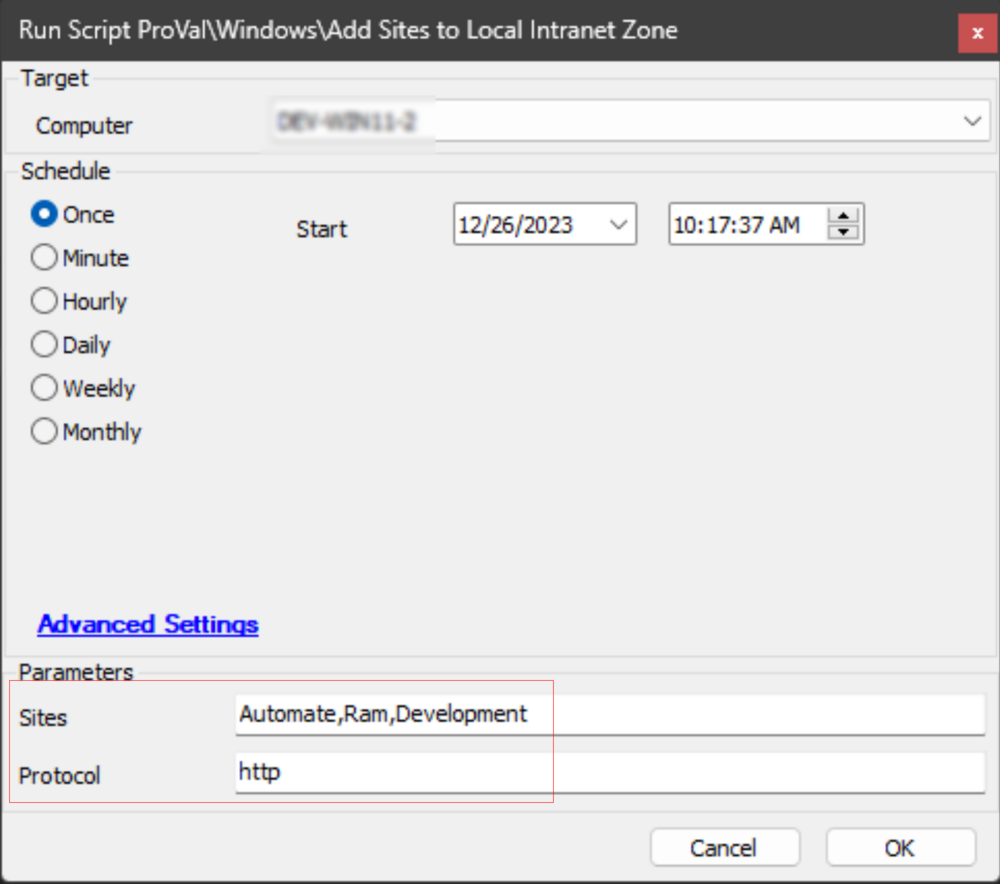
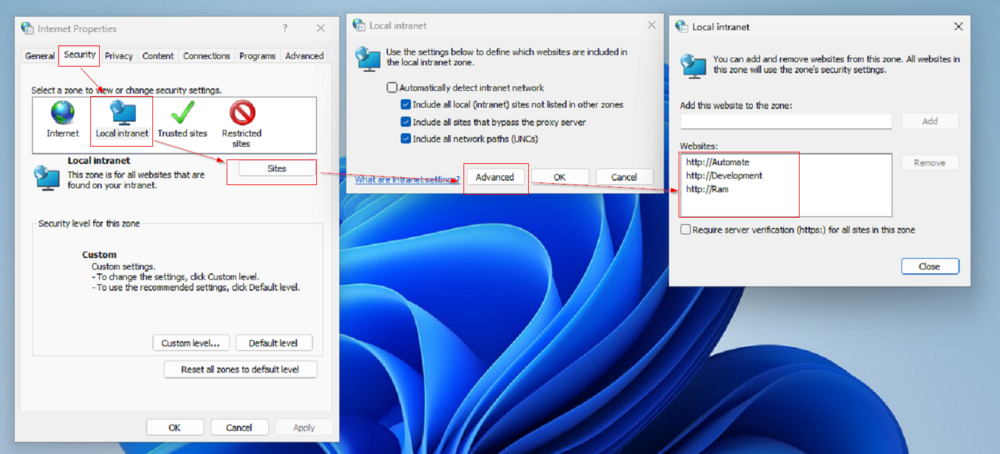
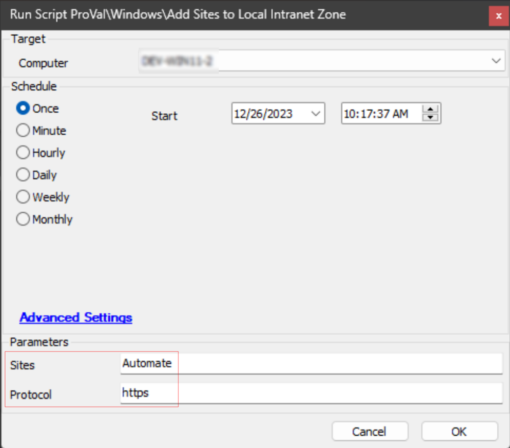
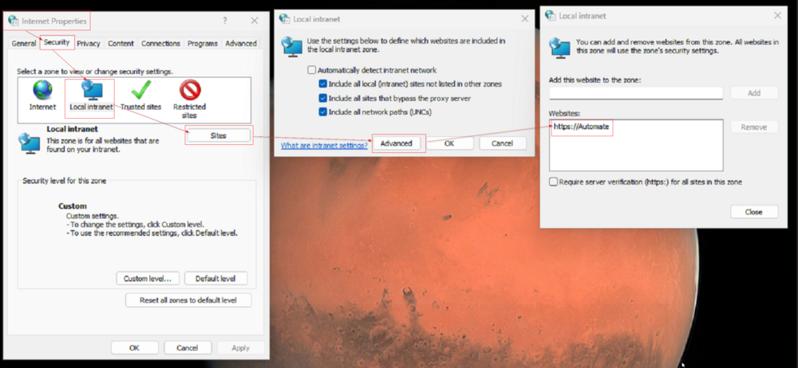
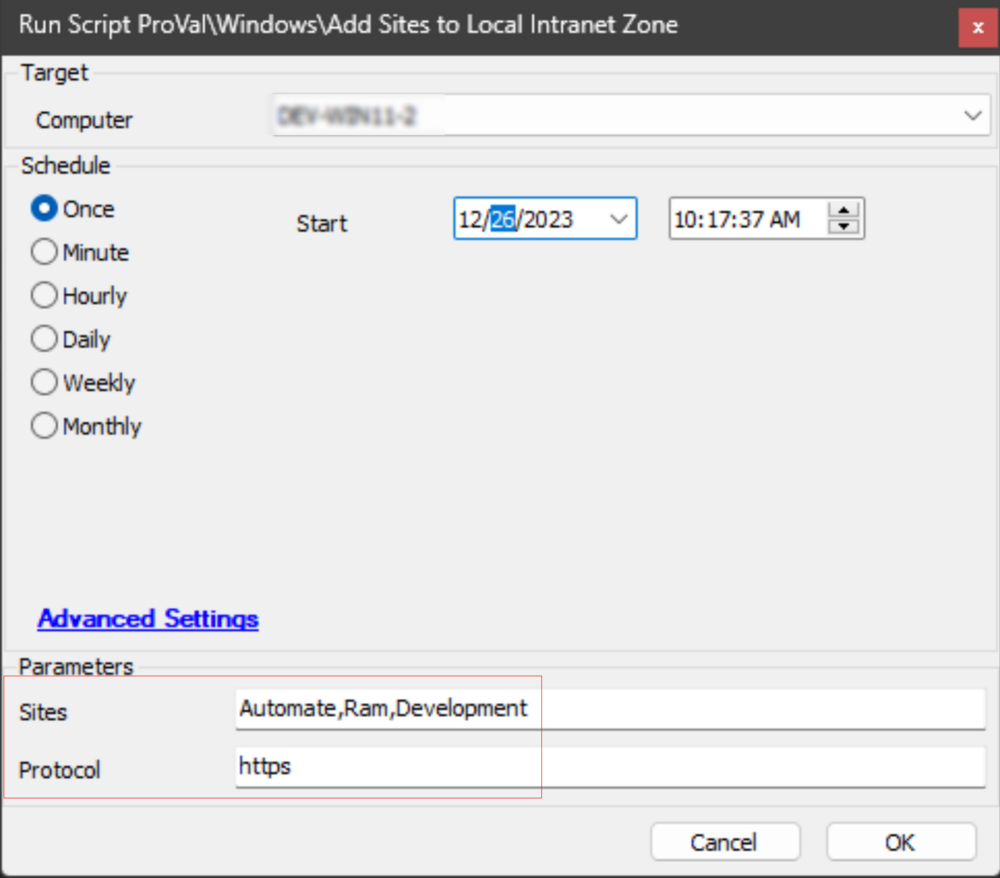
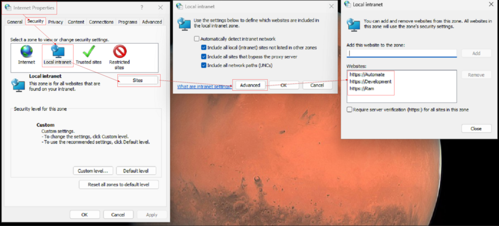

## Summary

The script functions by adding the site(s) specified in the `Sites` parameter to the local intranet zone on the Windows computer.

## Sample Run

**Input:**  

**Result:**  

**Input:**  

**Result:**  

**Input:**  

**Result:**  

**Input:**  

**Result:**  

## Variables

| Name              | Description                                      |
|-------------------|--------------------------------------------------|
| ProjectName       | Add-LocalIntranetSites                           |
| WorkingDirectory   | C:/ProgramData/_Automation/Script/Add-LocalIntranetSites |
| ScriptPath        | C:/ProgramData/_Automation/Script/Add-LocalIntranetSites/Add-LocalIntranetSites.ps1 |

#### User Parameters

| Name      | Example                                    | Required | Description                                                                                      |
|-----------|--------------------------------------------|----------|--------------------------------------------------------------------------------------------------|
| Sites     | AutomateAutomate,Ram,Development      | True     | Name of the site(s) to add to the local intranet zone. Multiple sites should be separated by a comma without any spaces between them. |
| Protocol  | https                                      | False    | Protocol to include along with the site. The default is HTTP. If this parameter is left blank, the script will automatically add HTTP along with the site. |

## Output

- Script Log

