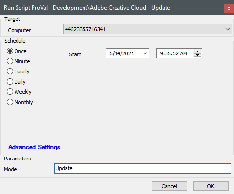
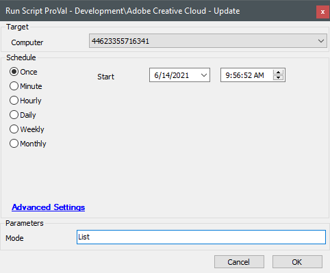

## Summary

This script will either list the available updates or run updates for the Adobe CC apps on the target machine.

**Time Saved by Automation:** 10 Minutes

## Sample Run

## Dependencies

This section should list the ITGlue documents found in the Related Items sidebar that this script depends on.

- [Update-AdobeCC](<../../powershell/Update-AdobeCC.md>)

## Variables

### User Parameters

| Name  | Example | Required | Description                                                |
|-------|---------|----------|------------------------------------------------------------|
| Mode  | Update  | True     | The mode in which the script should be run. Can only be either "Update" or "List". |

## Process

[Update-AdobeCC](<../../powershell/Update-AdobeCC.md>)

## Output

- Script log
- Local log files
