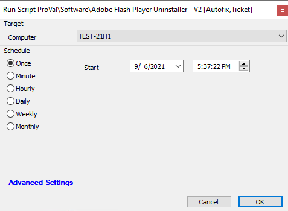

## Summary

This script runs as an Autofix script that helps to uninstall Adobe Flash Player from the target machine using multiple methods.

**Time Saved by Automation:** 20 Minutes

## Sample Run

## Dependencies

This script runs with a monitor named: **"Proval - Production - Adobe Flash Detected"**

### Global Parameters

| Name            | Example | Required | Description                                                                                                                                                          |
|-----------------|---------|----------|----------------------------------------------------------------------------------------------------------------------------------------------------------------------|
| TicketCreation   | 0       | False    | This parameter allows users to decide if they want a ticket created if the script fails to uninstall Adobe Flash Player. If yes, change it to 1.                  |

## Process

This script helps to uninstall Adobe Flash Player through multiple methods.  
First, it attempts to uninstall it using `uninstall.exe` of Adobe Flash Player.  
If that fails, it will try to uninstall using the Uninstaller Software script with the uninstaller string.

## Output

- Script log

