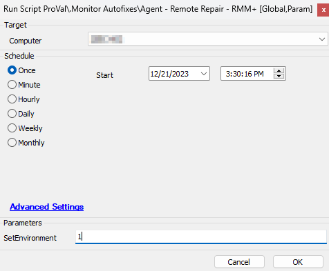
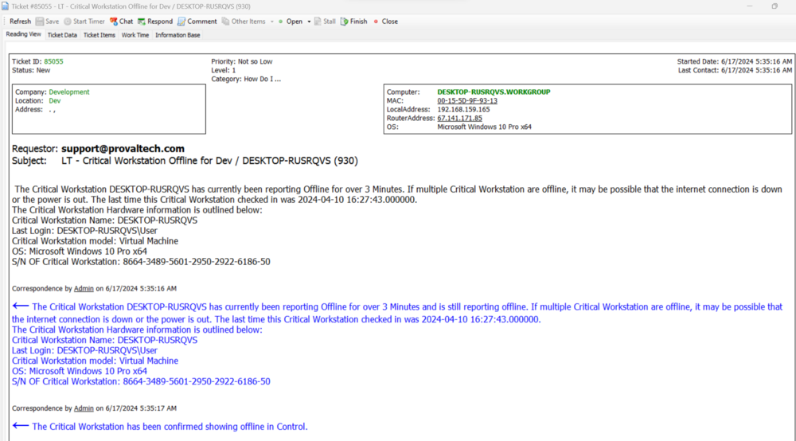
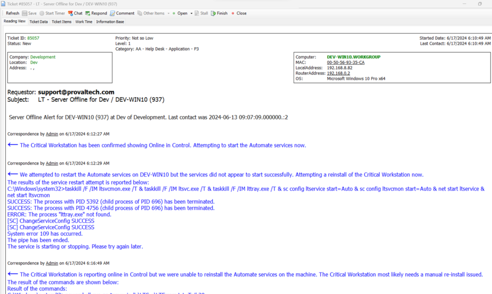

## Summary

The script utilizes the ConnectWise Automate RMM+ plugin to reinstall the Automate agent on machines that are showing offline, while the ScreenConnect agent is online.

This script deprecates CW Control RMM+ API - Offline Server AutoFix*

## Sample Run

This script is to be set as an autofix to an alert template and called from a monitor; however, this script uses a new system property for the offline threshold. You must run the script manually on a random machine with the 'SetEnvironment' variable set to 1:  
  

This will add the Offline Threshold property. It defaults to 11 minutes.

## Dependencies

- RMM+ should be installed and configured properly on the ScreenConnect platform as well as the Automate Platform.
- RMM+ should be up to date to ensure success.
- Alert Template - **△ Custom - Autofix - Critical Machine Offline (RMM+)** -> This alert template calls this script to run on the offline agent and attempt the autofix, creating a ticket for the failure from the script itself.
- Alert Template - **△ Custom - Default Ticket - Autofix - Critical Machine Offline (RMM+)** - It creates a ticket from the default ticketing feature and allows the script to comment on the created ticket for the failure. This is useful during the script engine's hung state to allow the alerting for the offline agents should work without the autofix.

## Variables

Document the various variables in the script. Delete any section that is not relevant to your script.

| Name                    | Description                                                                                       |
|-------------------------|---------------------------------------------------------------------------------------------------|
| VarLog                  | This is a running log of the results of specific steps in the script, this is used for troubleshooting issues. |
| TickID                  | This holds any current ticket that is present for the specific target machine.                   |
| Type                    | Agent Type whether Mac, Linux, Workstation or Server.                                            |
| BiosName                | This holds the target bios name.                                                                  |
| BiosVersion             | This holds the target bios version.                                                               |
| TicketCreationCategory   | This sets the ticket creation category for this script.                                          |
| TicketCreateBody        | This sets the body of the ticket that will be created.                                           |
| TicketComment           | This sets a comment for any current ticket.                                                      |
| Command                 | Used with RMM+ and is the command that will be passed to the target machine via ConnectWise Control. |
| SvcRestartResult        | This is the result of the attempted service restart.                                             |
| AgentOnline             | This is the online state of the target machine.                                                  |
| ReInstallResults        | This is the result of the attempted re-installation.                                             |
| ltErrorLogsAfter        | The post-re-installation content of the LTError.log file.                                        |
| TicketFinishBody        | This is the body of a ticket when the monitor enters a success state.                            |

#### Global Parameters

| Name                    | Example                                                                                                    | Required | Description                                                                                                                     |
|-------------------------|------------------------------------------------------------------------------------------------------------|----------|---------------------------------------------------------------------------------------------------------------------------------|
| TicketCreationSubject   | LT - @Type@ Offline for %LocationName% / %ComputerName% (%ComputerID%)                                   | True     | This designates the subject line of any ticket that this script creates. The @Type@ Variable can either be 'Critical Mac Machine', 'Linux Machine', 'Critical Workstation', or 'Server' |

## Properties

| Name            | Example | Required | Description                                                                                                       |
|-----------------|---------|----------|-------------------------------------------------------------------------------------------------------------------|
| OfflineThreshold | 11      | True     | The number of days a machine is offline before this script runs. This should be the same number as the monitor that calls this is set to. |

## Output

- Script log
- Ticket

## Ticketing

The ticket is controlled using two alert templates:
- Alert Template - **△ Custom - Autofix - Critical Machine Offline (RMM+)** -> This alert template calls this script to run on the offline agent and attempt the autofix, creating a ticket for the failure from the script itself.
- Alert Template - **△ Custom - Default Ticket - Autofix - Critical Machine Offline (RMM+)** -> It creates a ticket from the default ticketing feature and allows the script to comment on the created ticket for the failure. This is useful during the script engine's hung state to allow the alerting for the offline agents should work without the autofix.

<u><em>Note: It is mandatory to import the alert templates from the prosync plugin for the script to work.</em></u>

- If the alert template set at the offline monitor is "**△ Custom - Autofix - Critical Machine Offline (RMM+)",** then the ticket will be created from the script itself.  
The subject of this ticket can be modified by adjusting the TicketCreationSubject global parameter.  
  

- If the alert template set at the offline monitor is "**△ Custom - Default Ticket - Autofix - Critical Machine Offline (RMM+)",** then the ticket will be created from the monitor ticket subject, and the script will only perform the autofix and add ticket comment to it with the result:  
  

## FAQ

- Will Tickets autoclose?  
  - Yes, once the monitor enters a success state the ticket will be automatically finished.

- The log that comes along with this is very long.  
  - This is by intent, there are many calls to subscripts for RMM+ having detailed logging is necessary.

