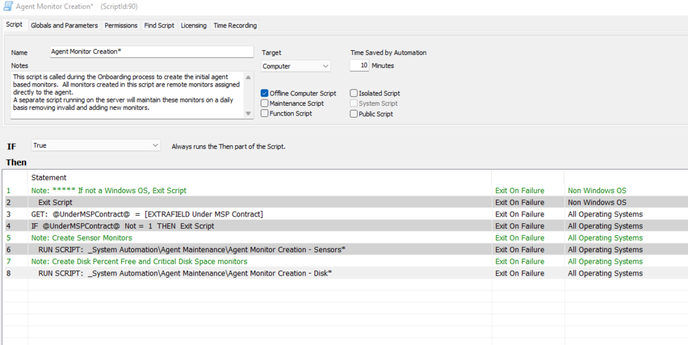
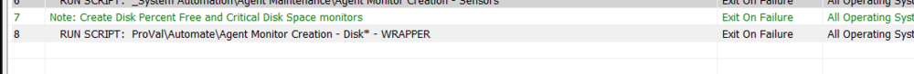

## Summary

This script MUST be called by the Agent Monitor Creation script and/or the Remove and Rebuild script to create disk monitors for machines.

On a default setup, change the Agent Monitor Creation Script - line 8ish to be the ProVal Disk Wrapper instead.

**Before**  
  

**After**  
  

Time Saved by Automation: 10 Minutes

## Sample Run

Cannot be run manually.

## Dependencies

- [Agent Monitor Creation - Disk Workstations 5 GB*](https://proval.itglue.com/DOC-5078775-8165873)  
- [Agent Monitor Creation - Disk Servers 5 GB*](https://proval.itglue.com/DOC-5078775-8143444)  

#### Global Parameters

| Name        | Example        | Required | Description                                                                 |
|-------------|----------------|----------|-----------------------------------------------------------------------------|
| ExcludeIDs  | 445,334,345    | False    | A list of comma-separated computer ids to exclude from monitor creation.   |

## Process

This script MUST be called by the Agent Monitor Creation script and the Remove and Rebuild script to create disk monitors for machines. It checks the computerid in the provided exclude list IDs. If any agent is found in that list then this script will not run on that agent and no monitors will be created.

## Output

- Script log

