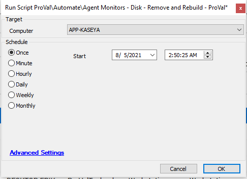

## Summary

This script clears existing Disk Monitors from an agent and reinstalls new Disk Monitors.

Should be run against the service plan for servers and workstations as part of the initial deployment.

Time Saved by Automation: 5 Minutes

## Sample Run

## Dependencies

- @Agent Monitor Creation - Disk* - WRAPPER

## Process

- Runs a default script Agent Monitors - Disk - Remove to remove the existing disk monitors
- Runs our Wrapper script [CWM - Automate - Script - Agent Monitor Creation - Disk* - WRAPPER](https://proval.itglue.com/DOC-5078775-8066337) to create new disk monitors on machines

## Output

- Script log

