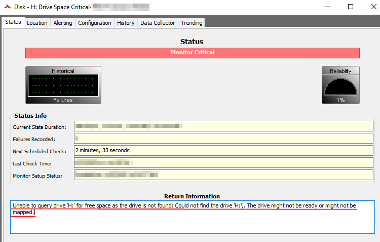
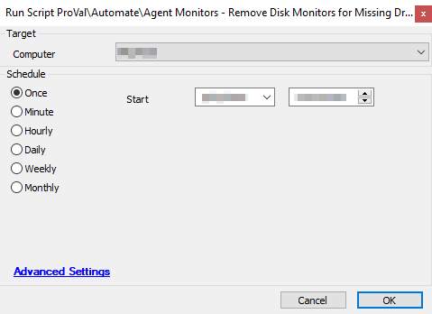

## Summary

This script is used to clean up older remote drive space monitors for drives that no longer exist on Windows systems. 

If there are tickets related to the following example message, this script should be run against those systems.  
**Example:**  
"Unable to query drive 'H:' for free space as the drive is not found: Could not find the drive 'H://'. The drive might not be ready or might not be mapped."

Or if there are Remote (System) monitors showing similar "Return Information" to the screenshot below.

It is safe to run this script against any Windows system.

**Time Saved by Automation:** 5 Minutes

## Sample Run

Target should be any Windows machine reporting inaccurate values for remote drive space monitoring (Drive Space Critical monitors).  
**Note:** This script CAN be run against offline agents.

## Dependencies

None at this time.

## Process

This script will first ensure the machine is a Windows device; otherwise, it will exit.

The script will create a log message indicating it will be cleaning up the broken remote drive space monitors.

The script will then run two different SQL queries to remove the broken remote drive space monitors.

## Output

Script log only.

