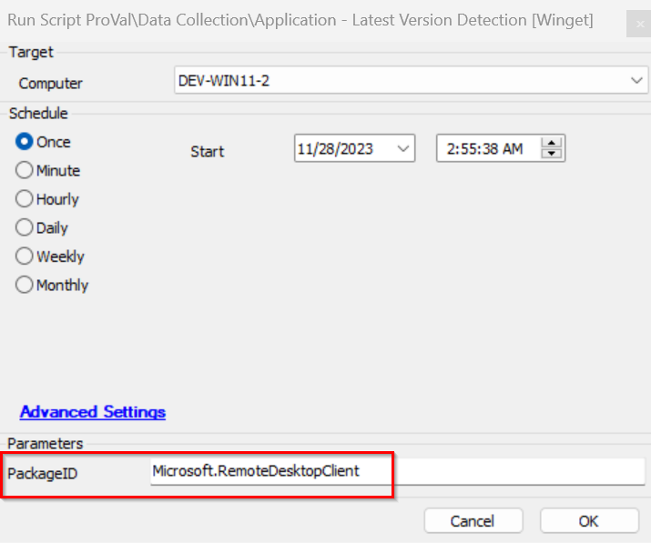

## Summary

This script is designed to gather the latest version of applications supported by Winget and store them in the system properties created with the name of the PackageID.

## Sample Run

## Variables

Document the various variables in the script. Delete any section that is not relevant to your script.

| Name  | Description                                                              |
|-------|--------------------------------------------------------------------------|
| psout | Contains the latest version number of the PackageID mentioned            |

#### User Parameters

| Name       | Example                       | Required | Description                                                                                     |
|------------|-------------------------------|----------|-------------------------------------------------------------------------------------------------|
| PackageID  | Microsoft.RemoteDesktopClient  | False    | The parameter passes the value to the script for the packageid application version detection    |

#### System Properties

| Name         | Example                       | Required | Description                                                                                     |
|--------------|-------------------------------|----------|-------------------------------------------------------------------------------------------------|
| @PackageID@  | Microsoft.RemoteDesktopClient  | False    | This automatically gets created by the script once the PackageID version detected with the PackageID name |

## Output

- Script log

