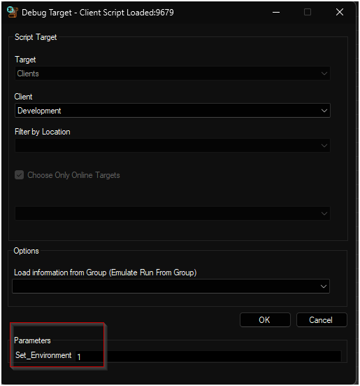
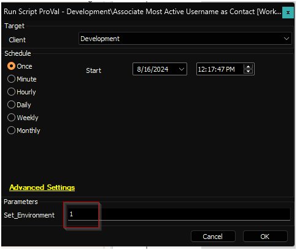
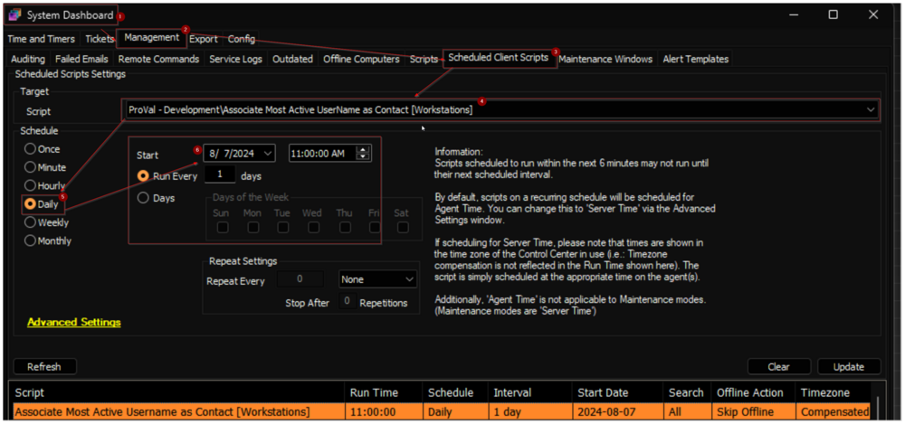

## Summary

The script determines the most active user on a computer and designates them as the primary contact in Automate.

A contact will be linked to the computer if any of the following conditions are met:

1. The contact’s email address is formatted as `Username@........`.
2. `Username` matches the `FirstName + LastName` stored in the contact.
3. `Username` matches the `FirstName` of the contact.

Notes:  
- If multiple conditions are satisfied, precedence is given to the contact identified by the first condition.
- `Username` refers to the currently logged-in user. If no user is logged in when the script runs, it will default to the last logged-in user.

## Implementation

1. Debug/Run the script against any client with the `Set_Environment` parameter set to `1` to create the EDFs used by the solution.  
     
   

2. Schedule the script to run once per day.  
   

## Client-Level EDF

| Name                       | Type      | Example | Section | Required | Description                                                                                     |
|----------------------------|-----------|---------|---------|----------|-------------------------------------------------------------------------------------------------|
| Auto Associate Contacts     | Check-Box | 0/1     | Default | True     | Mark this EDF to enable the contact auto association for the workstations of the client.       |

## Location-Level EDF

| Name                           | Type      | Example | Section | Required | Description                                                                                     |
|--------------------------------|-----------|---------|---------|----------|-------------------------------------------------------------------------------------------------|
| Auto Associate Contacts - Exclude | Check-Box | 0/1     | Default | True     | Mark this EDF to exclude the location's machines from the contact auto association.            |

## Computer-Level EDF

| Name                           | Type      | Example | Section | Required | Description                                                                                     |
|--------------------------------|-----------|---------|---------|----------|-------------------------------------------------------------------------------------------------|
| Auto Associate Contacts - Exclude | Check-Box | 0/1     | Default | True     | Mark this EDF to exclude the computer from the contact auto association.                       |

