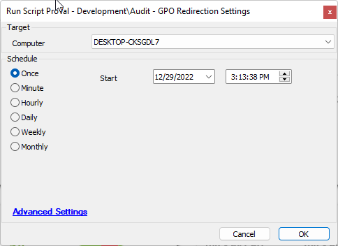

## Summary

This script will audit the registry settings associated with any group policy redirection settings populating [EPM - Data Collection - Custom Table - plugin_proval_gpo_redirection_audit](<../tables/plugin_proval_gpo_redirection_audit.md>) with the returned data.

## Sample Run

## Dependencies

- [CWM - Automate - Script - OverFlowedVariable - SQL Insert - Execute](<./OverFlowedVariable - SQL Insert - Execute.md>)
- [CWM - Automate - Script - PowerShell Response - All Errors - Check](<./PowerShell Response - All Errors - Check.md>)

## Variables

| Name                | Description                                                                                                                                                                                                                              |
|---------------------|------------------------------------------------------------------------------------------------------------------------------------------------------------------------------------------------------------------------------------------|
| ProjectName         | Holds a project name and is used when creating a .json file for any potential overflowed variable. Please reference [CWM - Automate - Script - OverFlowedVariable - SQL Insert - Execute](<./OverFlowedVariable - SQL Insert - Execute.md>) for more information. |
| WorkingDirectory     | Holds a working directory to be combined with the project name as the directory to save the .json file. Please reference [CWM - Automate - Script - OverFlowedVariable - SQL Insert - Execute](<./OverFlowedVariable - SQL Insert - Execute.md>) for more information. |
| TableName           | Holds the name of the table to be updated or created.                                                                                                                                                                               |
| JsonFileName        | The name of the json file to create. Please reference [CWM - Automate - Script - OverFlowedVariable - SQL Insert - Execute](<./OverFlowedVariable - SQL Insert - Execute.md>) for more information.                                   |
| SQLStartStatement    | The SQL start statement. Please reference [CWM - Automate - Script - OverFlowedVariable - SQL Insert - Execute](<./OverFlowedVariable - SQL Insert - Execute.md>) for more information.                                                |
| SQLTailString       | The SQL tail string. Please reference [CWM - Automate - Script - OverFlowedVariable - SQL Insert - Execute](<./OverFlowedVariable - SQL Insert - Execute.md>) for more information.                                                    |
| DataPointNames      | The names of the datapoints in the created .Json file. Please reference [CWM - Automate - Script - OverFlowedVariable - SQL Insert - Execute](<./OverFlowedVariable - SQL Insert - Execute.md>) for more information.                  |
| psout               | The return from the powershell script to gather the redirected folder data.                                                                                                                                                          |

## Process

1. Set up any static variables that I need for any dependent scripts, or current script steps.
2. Create the table if necessary.
3. Execute PowerShell
   1. Set up my static variables (current user locations, local machine locations, classes)
   2. Cycle through the local machine settings populating myinfo with class information.
   3. Cycle through all Current user locations populating myinfo with class information.
   4. Create a .json file.
4. Check the return from the target for any common PowerShell issues by running the [CWM - Automate - Script - PowerShell Response - All Errors - Check](<./PowerShell Response - All Errors - Check.md>) script.
5. If the finishstatus variable is set to false then log an error and exit with error.
6. Insert the data to the table using [CWM - Automate - Script - OverFlowedVariable - SQL Insert - Execute](<./OverFlowedVariable - SQL Insert - Execute.md>).
7. Log success and exit.

## Output

- Script log

