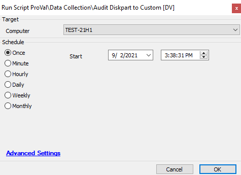

## Summary

This script creates a custom table `plugin_proval_diskpart_style`. Runs Powershell against Windows machines to fetch disk partition details and populate the information in the database.  
Time Saved by Automation: 10 Minutes

## Sample Run

## Dependencies

- [plugin_proval_diskpart_style](https://proval.itglue.com/DOC-5078775-8038983)  
- @Audit Disk Partition Styles - DV

## Process

- This script will first create the custom table in the Database.
- Then verify the Windows OS, if no then exit.
- Then script will run some Powershell to fetch disk partition details and store them inside the database.

## Output

- Dataview

