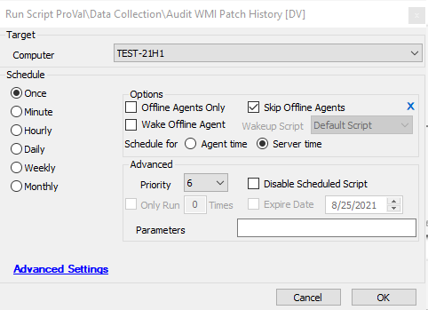

## Summary

This script audits the current patch history from .NET to a custom table (plugin_proval_wmipatchesinstalled).  
The script should be run against Windows OS machines, and PowerShell v2 or greater is required on the agent.  

**Time Saved by Automation:** 15 Minutes

## Sample Run

## Dependencies

- @plugin_proval_wmipatchesinstalled
- [Windows - Rollup Audit (WMI) [Script]](<../dataviews/Windows - Rollup Audit (WMI) Script.md>)

## Process

This script audits the current patch history from .NET to a custom table (plugin_proval_wmipatchesinstalled). The script creates the `plugin_proval_wmipatchesinstalled` table if it does not exist and deletes the current data for the target machine from the table. Then it executes the PowerShell to gather the patch information and inserts the new data into the table.

## Output

- The output will be populated in the Dataview Windows - Rollup Audit (WMI) [Script]

