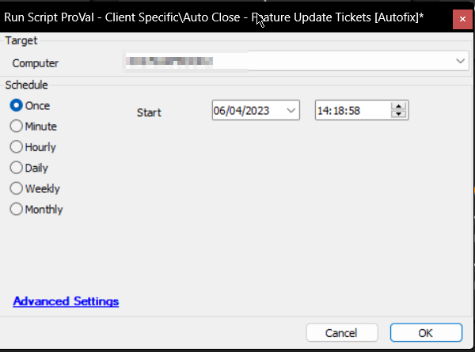

## Summary

The purpose of the script is to finish the new/open tickets created by the feature pack upgrading solution for the Windows 10 machines which are already updated to the latest build.

Affected ticket subjects:

- Pre-Reboot Installation Failure of Feature Update for %ClientName%/%ComputerName%
- Feature Update Reboot Ignored on %ClientName%/%ComputerName%

## Sample Run

## Dependencies

- [SEC - Windows Patching - Custom Table - plugin_proval_windows_os_support](<../tables/plugin_proval_windows_os_support.md>)
- [CWM - Automate - Internal Monitor - ProVal - Client Specific - Auto Close - Feature Update Tickets](https://proval.itglue.com/DOC-5078775-12579658)

## Variables

| Name        | Description                                    |
|-------------|------------------------------------------------|
| STATUS      | Status returned by the monitor set (FAILED/SUCCESS) |
| Count       | Number of tickets to finish                     |
| SQLTicketid | Ticketid to finish/close                       |

