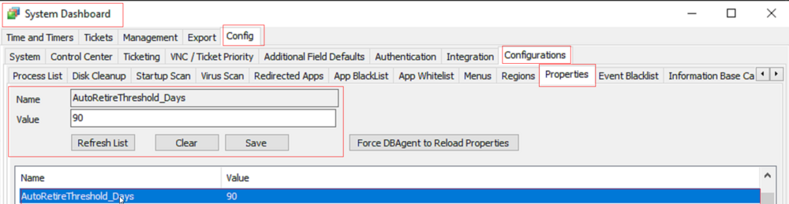
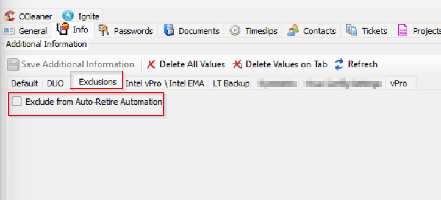
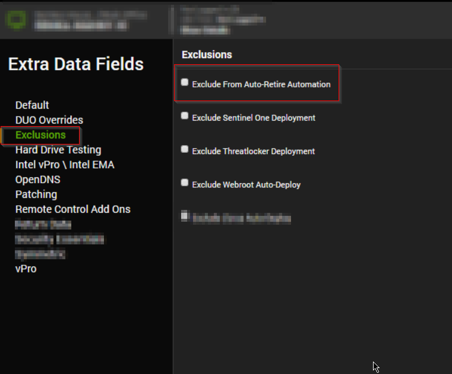
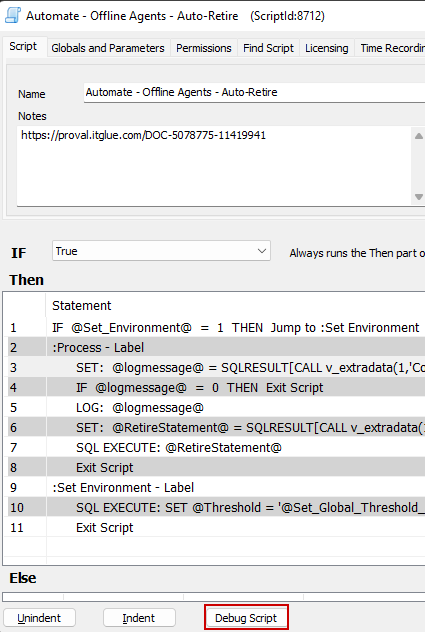
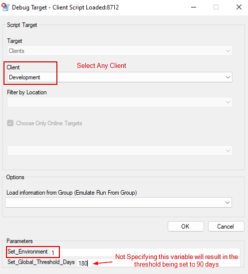
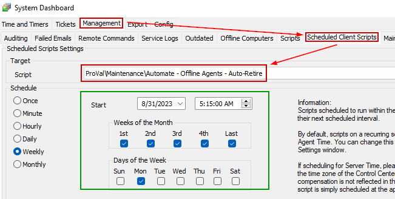

## Summary

The purpose of this script is to retire the computers that are offline in Automate for more than the days defined in the system property `AutoRetireThreshold_Days`.



The following EDFs can be used to overwrite the Threshold Days defined in the System property `AutoRetireThreshold_Days`.

- **Client-Level EDF**: "AutoRetire Threshold Days"


- **Location-Level EDF**: "AutoRetireThreshold_Days"


The following EDFs can be used to exclude a client/location/computer from retirement:

- **Client-Level EDF**: "Exclude From Auto-Retire Automation"


- **Location-Level EDF**: "Exclude From Auto-Retire Automation"



- **Computer-Level EDF**: "Exclude From Auto-Retire Automation"



## Sample Run

In order to create the system properties and EDFs utilized in the script, the 'Set_Environment' User Parameter should be set to 1 for its very first execution. The global property 'AutoRetireThreshold_Days' is set when the value in 'Set_Global_Threshold_Days' is specified. If left empty, the global property will default to '90'.

1. Open the script found under ProVal/Automate/Automate - Offline Agents - Auto-Retire and hit Debug Script.
   

2. Select any client and ensure that the 'Set_Environment' variable is set to 1. You can set the global threshold to whatever the partner requests. The default is 90 days if not specified.
   

3. Run this script with your custom settings.
   - **NOTE**: Setting a new threshold will NOT overwrite the existing threshold if this has been run before. You must manually modify the property if the threshold property is currently in the system.

It is suggested to schedule the script to run at regular intervals, preferably weekly, for better results.



## Implementation

- Import the script.
- Run the script against any client with the `Set_Environment` parameter set to 1 and `Set_Global_Threshold_Days` set to the number of days for the global property `AutoRetireThreshold_Days`.
- Schedule the script in the dashboard to run at regular intervals.

## Dependencies

[CWM - Automate - Solution - Offline/Broken Agents](<../../solutions/OfflineBroken Agents.md>)

**Computers marked as `Broken` by the [CWM - Automate - Script - Automate Agent - Auto Repair](<./Automate Agent - Auto Repair.md>) script are excluded from retirement.**

## Variables

| Name              | Description                             |
|-------------------|-----------------------------------------|
| RetireStatement    | SQL Query used to retire the computers  |

### User Parameters

| Name                      | Example | Required                   | Description                                                                                                                                                                                                 |
|---------------------------|---------|----------------------------|-------------------------------------------------------------------------------------------------------------------------------------------------------------------------------------------------------------|
| Set_Environment           | 1       | Mandatory for first run    | For the script's initial execution, this parameter must be used. The dependent EDFs and the system property are essential for the script to function properly. These required EDFs and System Property are created when the script is executed with this parameter set to 1. |
| Set_Global_Threshold_Days | 45      | False                      | The global property 'AutoRetireThreshold_Days' is set when the value in 'Set_Global_Threshold_Days' is specified. If left empty, the global property will be set to '90'.                                     |

### System Properties

| Name                      | Example | Required | Description                                                                                                                             |
|---------------------------|---------|----------|-----------------------------------------------------------------------------------------------------------------------------------------|
| AutoRetireThreshold_Days  | 90      | True     | Threshold days to retire the offline computers. The default is 90. It can either be set during the first execution of the script or manually from the dashboard. |

### Extra Data Fields

| Name                           | Level   | Section     | Type      | Required | Description                                                                                                                        |
|--------------------------------|---------|-------------|-----------|----------|------------------------------------------------------------------------------------------------------------------------------------|
| Exclude From Auto-Retire Automation | Client  | Exclusions  | Check box | False    | The script will not generate any tickets for the client if this EDF is checked.                                                  |
| Exclude From Auto-Retire Automation | Location | Exclusions  | Check box | False    | The script will not include any computer from the location in the ticket if this EDF is checked.                                   |
| Exclude From Auto-Retire Automation | Computer | Exclusions  | Check box | False    | The script will not include the computer in the ticket if this EDF is checked.                                                   |
| AutoRetire Threshold Days      | Client  | Default     | TextBox   | False    | To overwrite the threshold set in the global property `AutoRetireThreshold_Days` for the client.                                  |
| AutoRetire Threshold Days      | Location | Default     | TextBox   | False    | To overwrite the threshold set in the global property `AutoRetireThreshold_Days` and Client-Level EDF `AutoRetire Threshold Days` for the location. |

## Output

- Script log

## Sample Log

```
2023-09-20 15:49:53: Retiring 4 obsolete agents

Computer ID: 896
Computer Name: DEV-WIN11-DCJOI
Client Name: Development
Location Name: Dev
Operating System: Microsoft Windows 11 Pro x64
Last Contact: 2022-09-20 15:46:02
Last Logged In User: PROVALDEV/Test

Computer ID: 904
Computer Name: DEV-WIN11-2
Client Name: Development
Location Name: Dev
Operating System: Microsoft Windows 11 Pro x64
Last Contact: 2022-09-20 15:47:48
Last Logged In User: DEV-WIN11-2/Test

Computer ID: 912
Computer Name: DEV-WIN11-1
Client Name: Development
Location Name: Dev
Operating System: Microsoft Windows 11 Pro x64
Last Contact: 2022-09-20 13:04:05
Last Logged In User: DEV-WIN11-1/Test

Computer ID: 917
Computer Name: DEV-WIN10-DCJOI
Client Name: Development
Location Name: Dev
Operating System: Microsoft Windows 10 Pro x64
Last Contact: 2022-09-20 15:49:13
Last Logged In User: DEV-WIN10-DCJOI/Test
```
