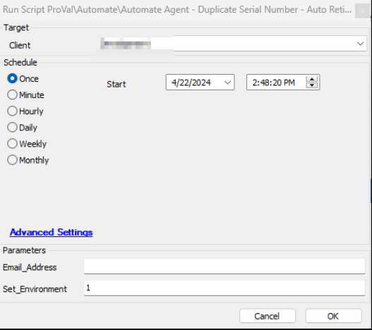
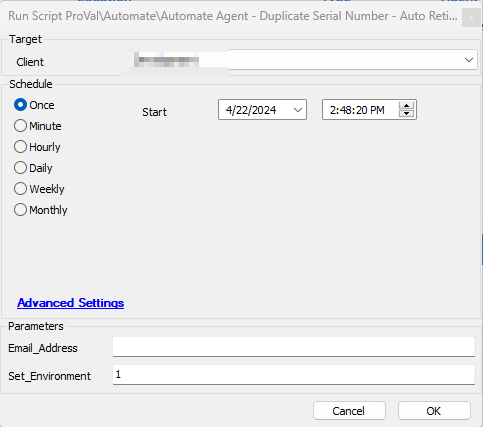
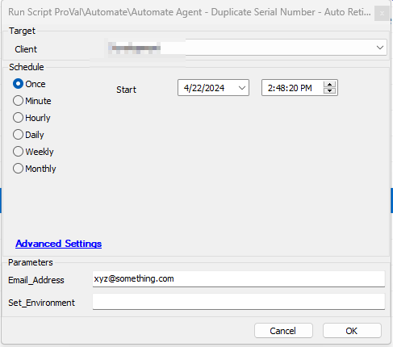
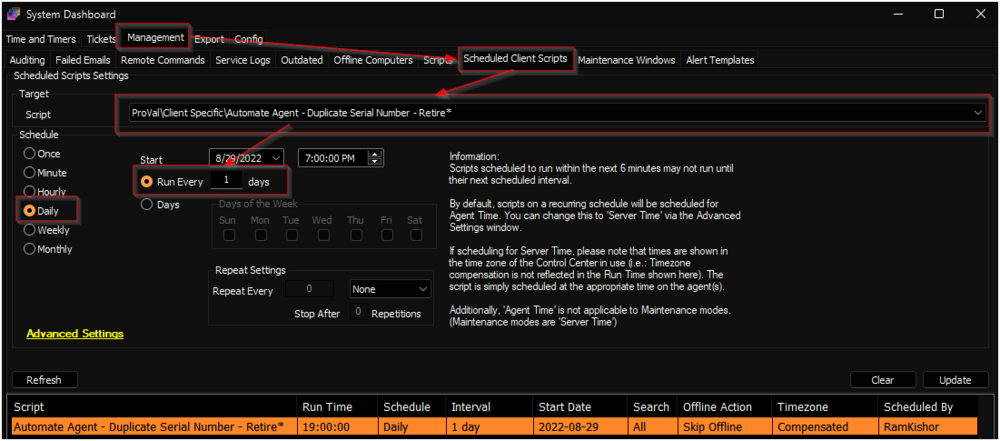

## Summary

The script retires duplicate agents from the Automate environment. A duplicate agent is identified based on its serial number, name, and client affiliation. Agents are removed based on their last contact with the Automate server, keeping only the agent with the most recent date. The script also emails or generates tickets for the list of duplicate agents that have been retired.

This is a client script and will work only for physical machines. Virtual machines are excluded to prevent any accidental deletion. It can be set up to email the list of duplicate agents that have been retired by the script to any email address, or a ticket can also be generated.

## Update Notice: 27 December 2024

Introduced the following system properties:
- `_sysDuplicateAgent_Contact_Threshold`
- `_sysDuplicateAgent_Retire_VM`

Run the script with the `Set_Environment` parameter to import the newly introduced properties.

Remove the `Automate Agent - Duplicate Serial Number - Retire` script if it exists.

## Sample Run

Set the parameter `Set_Environment` for the first execution.

Specify the email address where you would like to receive the output of the result.

## Schedule

It is suggested to run the script once per schedule.

## System Property

| Name                                          | Required | Example                          | Description                                                                                                                                                                                                                 |
|-----------------------------------------------|----------|----------------------------------|-----------------------------------------------------------------------------------------------------------------------------------------------------------------------------------------------------------------------------|
| `_sysDuplicateAgentEmailAddress`              | False    | [xyz@something.com](mailto:xyz@something.com) | Universal email address where you would like to receive the list of duplicate agents that have been retired by the script.                                                                                                 |
| `_sysDuplicateAgentTicketingEnable`           | False    | 1                                | Set to '1' if you would like to receive a ticket with a list of duplicate agents; otherwise, leave it blank or set to '0'.                                                                                               |
| `_sysDuplicateAgentTicketCategory`            | False    | 234                              | Specify the ticket creation category to direct tickets to the correct board in Manage. **Note:** If no ticket creation category is mentioned, the script will use the universal ticket creation category in the global System property `MonitorTicketCategory`. |
| `_sysDuplicateAgent_NoDuplicate_Ticketing`    | False    | 0                                | Set to '1' to receive tickets/emails when there are no duplicate agents. The default value is '0', meaning the script will not generate tickets/emails if no duplicate agents are found.                                 |
| `_sysDuplicateAgent_Ticketing_DefaultClientid`| False    | 1                                | Client ID under which tickets should be generated. The default value is '1', meaning tickets will be generated under the client whose client ID is '1' in the environment.                                                  |
| `_sysDuplicateAgent_Contact_Threshold`        | False    | 15                               | Define the threshold for the number of days after which duplicate agents should be retired. If this property is not specified, duplicate agents with a last contact time of more than an hour will be automatically removed. |
| `_sysDuplicateAgent_Retire_VM`                | False    | 1                                | Set to '1' to retire duplicate virtual machines as well (based on serial number). If nothing is mentioned, the script will not retire duplicate virtual machines.                                                          |

## User Parameters

| Name             | Required                  | Example                          | Description                                                                                                                                                                                                                 |
|------------------|---------------------------|----------------------------------|-----------------------------------------------------------------------------------------------------------------------------------------------------------------------------------------------------------------------------|
| `Email_Address`   | False                     | [xyz@something.com](mailto:xyz@something.com) | Provide an email address where you would like to receive the list of duplicate agents retired by the script. **Note:** If nothing is mentioned, the script will check the system property `_sysDuplicateAgentEmailAddress`. If an email address is specified there, it will send an email to it; otherwise, it will not send any email. |
| `Set_Environment` | True (For First execution) | 1                                | Set to '1' to create the system properties if they are not already created in the environment. This must be set to '1' for the first execution.                                                                              |

## Output

- Script Logs
- Ticketing
- Email

## Ticketing

Tickets will only be generated if the system property `_sysDuplicateAgentTicketingEnable` is set to '1'.

**Subject:** `List of Retired Duplicate Agents Based on Serial Numbers`

**Body:** `"%ScriptName% ran on the machines and has retired the following duplicate agents:@Machines@"`

In case there are no duplicate serial numbers:

`No duplicate machines identified based on serial number.`

