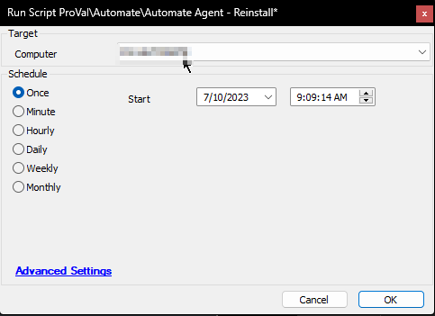

## Summary

This script is used to perform a full uninstall and reinstall of the CWA Agent on the target machine through the ConnectWise Control RMM+ add-in.

**Time Saved by Automation:** 5 Minutes

## Sample Run

**Target:** Windows and MAC agents

## Dependencies

- LTPoSH Community Module ([https://bit.ly/LTPoSH](https://bit.ly/LTPoSH))
- [CW RMM+ Plugin Configuration](https://proval.itglue.com/5078775/docs/9770217)
- [CWM - Control - Script - ScreenConnect Client - Connectivity - Audit*](https://proval.itglue.com/DOC-5078775-8143436)
- [CWM - Control - Script - ScreenConnect Client - Command - Execute*](https://proval.itglue.com/DOC-5078775-8141008)
- Agent - Generate Location Installer URL*

#### System Properties

| Name                          | Example                                    | Required | Description                                                                                                                                   |
|-------------------------------|--------------------------------------------|----------|-----------------------------------------------------------------------------------------------------------------------------------------------|
| RMMPlus_AccessKey             | ajw8fh2p93ufn;o31ifu2091j23oif            | True     | This is the key setup in the CW Control RMM+ Plugin so Automate can reach out to gain access to the API.                                   |
| RMMPlus_Headers               | Origin: [site.site.com](http://site.site.com) | True     | This is the URL (without http/https) for the CW Control server. This value needs to match the value in the RMM+ Plugin configuration in CW Control. |
| RMMPlus_StaleAgentThreshold   | 30                                         | True     | The number of days to indicate what a "stale" agent is to the scripts. 30 is the default.                                                  |
| RMMPlus_Timeout               | 1000                                       | True     | The default timeout for commands runs via RMM+ through Automate. 1000 is the default.                                                      |

## Output

- Script log messages only.

