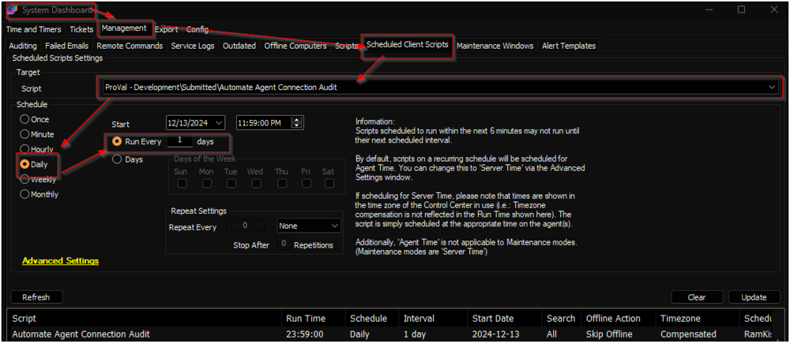

## Summary

The script generates two custom tables: [pvl_automate_connection_audit](https://proval.itglue.com/DOC-5078775-18178744) and [pvl_automate_connection_audit_daily](https://proval.itglue.com/DOC-5078775-18178747). It calculates and records the daily online and offline times of all machines in the [pvl_automate_connection_audit_daily](https://proval.itglue.com/DOC-5078775-18178747) table, using the data stored in the [pvl_automate_connection_audit](https://proval.itglue.com/DOC-5078775-18178744) table.

## Sample Run

- Debug the script against any random client to import the custom tables.  
- Schedule the script to run once per day around midnight:  
    

## Output

- Script Log

