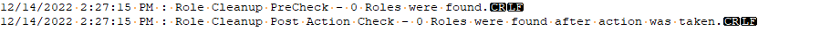

## Summary

This script is called from [CWM - Automate - Script - Automate Database Maintenance Solution](https://proval.itglue.com/DOC-5078775-11637293). 

This script handles cleanup of the following table(s):  
ComputerRoleDefinitions - Requires [CWM - Automate - Script - Automate Database Maintenance Solution](https://proval.itglue.com/DOC-5078775-11637293) MissingRoles_Cleanup Global Variable Set to 1.

## Sample Run

This script is a function script called from [CWM - Automate - Script - Automate Database Maintenance Solution](https://proval.itglue.com/DOC-5078775-11637293).

## Variables

| Name         | Description                                                                                                                                                      |
|--------------|------------------------------------------------------------------------------------------------------------------------------------------------------------------|
| Verify       | This variable verified both the starting count of targeted data, as well as the after action count of targeted data. We expect the starting count will be a value bigger than 0, and an after action value of 0. |
| LogMessage   | This is the running Log holding variable. Please note this variable is always set the same everywhere it's used in the solution. @logMessage@ = @LogMessage@[Linebreak]%when% : [Category] Cleanup [Stage] - Result. Please continue to utilize this standard with this running log file. |

## Output

This script will add the following section to the log variable:

