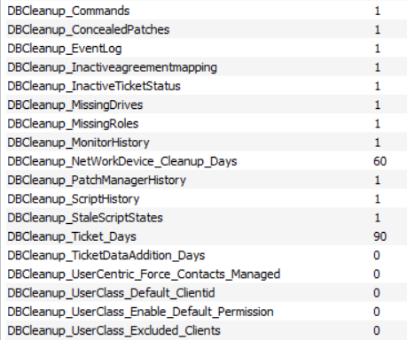
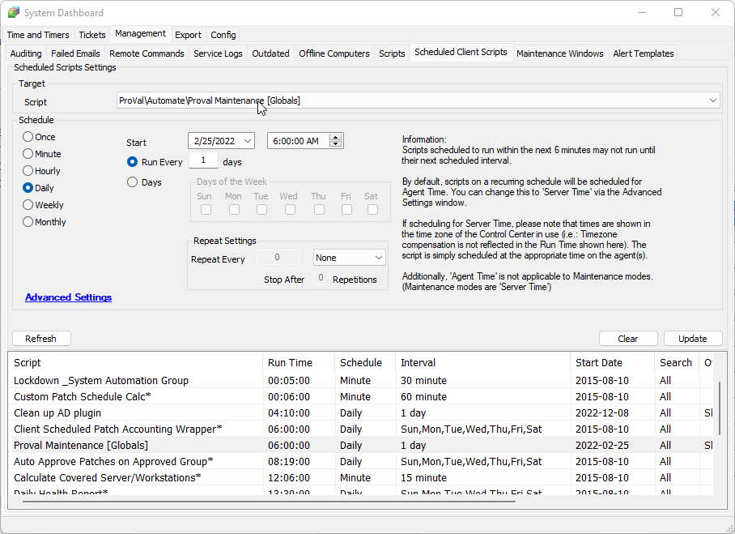
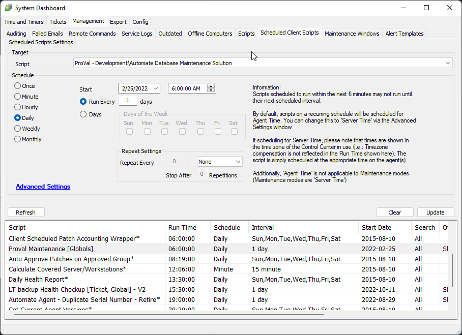
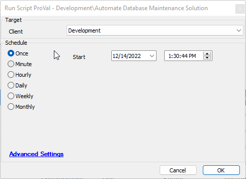
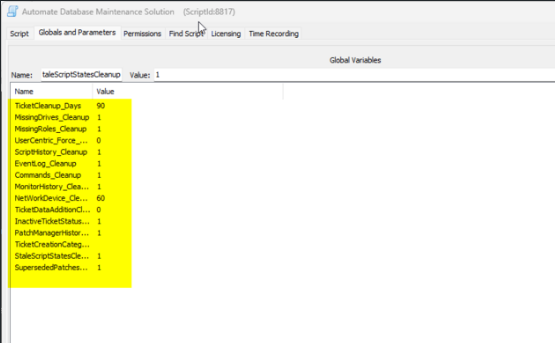
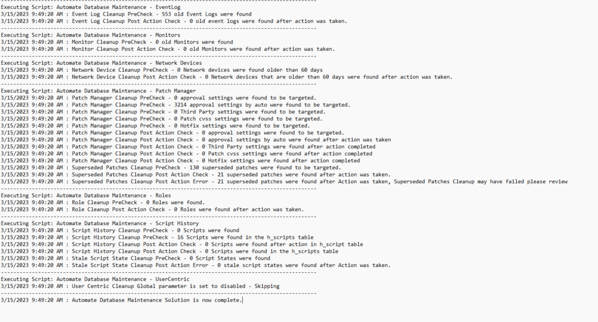

## Summary

This script is a wrapper to execute any number of recommended Automate Database Tasks. It introduces a log to the first computer or the Automate server on the LTShare for that device. This solution is intended to replace the ProvalMaintenance script.

### Changes:
1. Truncate the `windowsupdateetlfiles` table and [disable the ETL files collection](https://connectwise20.my.site.com/serviceandsupport/s/article/Disable-Windows-10-Log-File-collection-to-relieve-web-congestion).
2. Separated out function scripts to accomplish specific tasks:
   - Tickets
   - Drives
   - Commands
   - Event logs
   - Monitors
   - Network Devices
   - Patch Manager
   - Roles
   - Script History
   - User Centric
3. Functions rely on the global parameters set in the Automate Database Maintenance Solution Script.
4. Logging for all actions and a historical record of events.

## Implementation

This is a client-level script and should be scheduled to run regularly to maintain database cleanliness.

**FRESH INSTALLATION**:
- Run the script with the user parameter "Set_Environment" value set to 1, in order to set the system properties.
- It will set the system properties to the default value as shown in the screenshot below. You can change the values of these parameters as per the client's requirement by modifying the system properties directly.
  
  

- Open your system dashboard and navigate to Management / Scheduled Client Scripts.
  
  

- Add a new scheduled script, setting it up the same way that Proval Maintenance is set up. Instead of calling ProvalMaintenance, we will call Automate Database Maintenance Solution.
  
  

- It can be manually run if desired by selecting a client and picking the client script.
  
  

**UPDATING THE EXISTING SOLUTION**:
- Take a screenshot of the global parameters of the script before updating it as shown below:
  
  

- Follow all the steps as a fresh installation with `set_environment = 1` for the first run after the update and schedule the script if it's not already scheduled.
- Now compare all the global parameters from the old script with the new system properties and change the values in the system properties that are different from the old global properties.

## Variables

| Name              | Description                                                                                                                                                                                                                     |
|-------------------|---------------------------------------------------------------------------------------------------------------------------------------------------------------------------------------------------------------------------------|
| LogMessage         | This is a running log variable that holds the entirety of the text file used in logging. This variable should be utilized in each sub-script to add to this variable and keep the running log. All instances beyond the first should be `@logmessage@ = @logmessage@ [add something one line down] |
| ComputerID         | The computer ID of the target machine to upload the log to. It selects the Automate server or the first domain controller in the environment by ID.                                                                             |

## System Properties

| Name                                         | Example                                | Required | Description                                                                                                                                                                                                                             |
|----------------------------------------------|----------------------------------------|----------|-----------------------------------------------------------------------------------------------------------------------------------------------------------------------------------------------------------------------------------------|
| DBCleanup_Ticket_Days                        | 0 or blank for disabled                | False    | The time in days ago that you would like all tickets removed if created before. By default, its value will be '60' days.                                                                                                             |
| DBCleanup_MissingDrives                      | 0 or blank to disable                  | False    | This toggles the missing drive cleanup step. By default, its value will be '1'.                                                                                                                                                       |
| DBCleanup_MissingRoles                       | 0 or blank to disable                  | False    | This toggles the roles cleanup. By default, its value will be '1'.                                                                                                                                                                   |
| DBCleanup_UserCentric_Force_Contacts_Managed| 0 or blank to disable                  | False    | This toggles the UserCentric cleanup. By default, its value will be '0'.                                                                                                                                                             |
| DBCleanup_ScriptHistory                      | 0 or blank to disable                  | False    | This toggles the script history cleanup. By default, its value will be '1'.                                                                                                                                                           |
| DBCleanup_EventLog                           | 0 or blank to disable                  | False    | This toggles the event log cleanup. By default, its value will be '1'.                                                                                                                                                               |
| DBCleanup_Commands                           | 0 or blank to disable                  | False    | This toggles the commands cleanup. By default, its value will be '1'.                                                                                                                                                                |
| DBCleanup_MonitorHistory                     | 0 or blank to disable                  | False    | This toggles the monitor history cleanup. By default, its value will be '1'.                                                                                                                                                          |
| DBCleanup_NetWorkDevice_Cleanup_Days        | 0 or blank for disabled                | False    | The time in days ago that you would like the network devices removed if not checked in since. By default, its value will be '60'.                                                                                                    |
| DBCleanup_TicketDataAddition_Days           | 0 or blank for disabled                | False    | The time in days ago that you would like any additional ticket data cleaned up. By default, its value will be '0'.                                                                                                                    |
| DBCleanup_InactiveTicketStatus               | 0 or blank to disable                  | False    | This toggles the Inactive Ticket Status cleanup. By default, its value will be '1'.                                                                                                                                                   |
| DBCleanup_PatchManagerHistory                | 0 or blank to disable                  | False    | This toggles the Patch Manager cleanup. By default, its value will be '1'.                                                                                                                                                           |
| DBCleanup_StaleScriptStates                  | 0 or blank to disable                  | False    | This toggles the Stale Script States cleanup. By default, its value will be '1'.                                                                                                                                                     |
| DBCleanup_ConcealedPatches                   | 0 or blank to disable                  | False    | This toggles the superseded patches cleanup. By default, its value will be '1'.                                                                                                                                                      |
| DBCleanup_InactiveAgreementMapping           | 0 or blank to disable                  | False    | This toggles the inactive agreement mappings cleanup for the CW Manage plugin. By default, its value will be '1'.                                                                                                                     |
| DBCleanup_UserClass_Enable_Default_Permission | 0 to disable                            | False    | Set it to "1" to enable sync of user class permissions from Default Client to all other clients. By default, its value will be '0'.                                                                                                   |
| DBCleanup_UserClass_Default_ClientID         | 0 to disable                            | False    | Mention the client's client ID from which you would like to copy the permissions to other clients. By default, its value will be '0'.                                                                                                |
| DBCleanup_UserClass_Excluded_Clients         | 0 to disable                            | False    | Mention the client IDs you would like to exclude from getting the default user class permissions. By default, its value will be '0'.                                                                                                  |

## User Parameter

| Name              | Example | Required                                         | Description                                                                                                                                                                                                                       |
|-------------------|---------|--------------------------------------------------|-----------------------------------------------------------------------------------------------------------------------------------------------------------------------------------------------------------------------------------|
| Set_Environment    | 1       | Needs to be set to 1 for first-time implementation   | Running the script with the user parameter `Set_Environment` as `1` will import the System Properties needed for the script.                                                                                                     |

## Process

1. Set up a log variable.
2. Run ticket cleanup.
3. Run drives cleanup.
4. Run commands cleanup.
5. Run event log cleanup.
6. Run monitor cleanup.
7. Run network device cleanup.
8. Run patch manager cleanup.
9. Run roles cleanup.
10. Run script history cleanup.
11. Run user-centric cleanup.
12. Write the log to file.
13. Upload the log to the first computer or the Automate server.

## Output

The script log represents a log file. This is a representation of the expected log file.  

