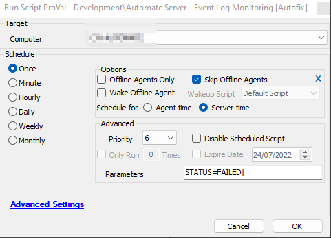

## Summary

The purpose of the script is to send information about the event logs detected by the ["ProVal - Development - Automate Server - Unwanted Event Logs Monitoring"](../monitors/Unwanted%20Event%20Logs%20Monitoring.md) monitor set. The result sometimes exceeds the character limit of 100 characters; hence, the script is needed for alerting purposes. Additionally, this script is not designed to send any notifications for the Success status of the monitor set.

## Sample Run

This is an Autofix script, and it is used within the "Automate Server - Event Log Monitoring [Autofix]" alert template.

## Dependencies

["ProVal - Development - Automate Server - Unwanted Event Logs Monitoring"](../monitors/Unwanted%20Event%20Logs%20Monitoring.md)

## Variables

| Name       | Description                                                                              |
|------------|------------------------------------------------------------------------------------------|
| STATUS     | Status returned by the monitor set: FAILED/SUCCESS                                       |
| shellresult| Outcome of the command fetching the unwanted event logs from the machine                |
| Email      | [Alerts@provaltech.com](mailto:Alerts@provaltech.com)                                   |

## Process

1. Verifies the monitor status; exits for Success and performs the following steps for Failure.
2. Runs the same command used within the ["ProVal - Development - Automate Server - Unwanted Event Logs Monitoring"](../monitors/Unwanted%20Event%20Logs%20Monitoring.md) monitor set.
3. Emails the outcome of the command (%shellresult%) to [alerts@provaltech.com](mailto:alerts@provaltech.com) in order to generate an urgent ticket in our (ProVal's) Autotask board.

## Output

- **Email**

