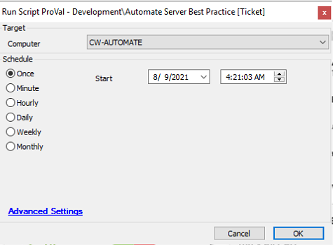

## Summary

This script goes through the process of Auditing and setting up hardening rules and policies relating to the recently published CW document [Hardening Automate (on-prem) Servers](https://proval.itglue.com/DOC-5078775-8025389).

Time Saved by Automation: 30 Minutes

## Sample Run

## Variables

- `@Admins@`: Name of the local admins.
- `@PrivTicOutput@`: Output of command "SecEdit /export /cfg $TemplateFilename /areas USER_RIGHTS".
- `@OpenPorts@`: List of the open ports to be closed.
- `@LTSharePermissions@`: Output of the command, "Get-SmbShareAccess -Name 'LTShare' | select-object accountname, accessright".
- `@CperUsers@`: List of Automate users with permissions to connectwise control plugin.

## Process

> Get the name of users/groups added in Administrators group and add to the ticket.  
> Sets following GPOs:  
> --> Do Not Allow Anonymous Enumeration of SAM accounts and Shares  
> --> Disallow AutoPlay for non-volume devices  
> --> Do not execute any autorun commands  
> --> Turn off AutoPlay  
> --> Always install with elevated privileges  
> Get the name of users/groups acting as Operating System and add to the ticket.  
> Checks the Open ports on the windows firewall for following and will add the port number to the ticket if open  
> --> Port 70 TCP, Ports 70-74 UDP, Port 8002 TCP/UDP, Ports 40000-40050 TCP, Ports 40000-41000 UDP, Port 3389  
> Following ports are checked only if server is placed in Domain  
> --> Port 135: MSRPC, Port 139: NetBios, Port 445: Microsoft-ds  
> Disables TLS1.0 and TLS1.1  
> Checks the permissions assigned to the users/user classes for "LTSHARE" and add the permissions in ticket for the client to review. Apart from this sets the permissions for EVERYONE to read only.  
> Disable HTTP Headers  
> Disable HTTP Options  
> Checks and add the users to the ticket with the permissions of Connectwise Control plugin.  
> [Automate Comprehensive Best Practice Guide](https://university.connectwise.com/content/userdocs/business_knowledge/Automate_Comprehensive_Best_Practice_Guide.pdf)

## Output

- Ticket
- Script Log

