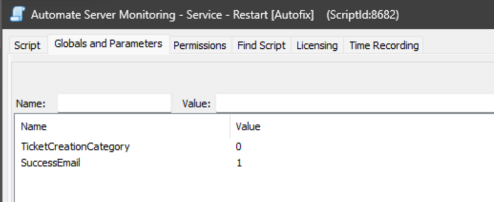
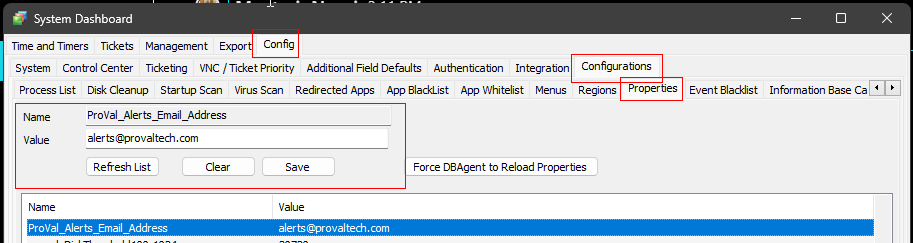

## Summary

This script is used with the remote monitors of the [Solution - Automate server and CW Manage Plugin Monitoring](https://proval.itglue.com/5078775/docs/10390988), which needed to be created due to static Global Variables and a specific `Subject` that had to be used.

The script will only send a SUCCESS email if a FAILURE email has already been sent for that service.

## Sample Run

This script will not work manually; it can be used via the `△ Custom - Autofix - Restart Service - Automate Server Monitoring` alert template. This script is intended only for use from a monitor alert template.

## Dependencies

- [Agnostic - Invoke-RestartService](<../../powershell/Invoke-RestartService.md>)
- [Solution - Automate server and CW Manage Plugin Monitoring](https://proval.itglue.com/5078775/docs/10390988)

## Variables

| Name         | Description                                           |
|--------------|-------------------------------------------------------|
| STATUS       | Status returned from Monitor Set (SUCCESS|FAILED)     |
| FieldName    | Service name returned from Monitor set                 |
| Subject      | Ticket/Email Subject                                   |
| Body         | Ticket/Email Body for Failure                          |
| Comment      | Ticket/Email Comment for Failure                       |
| TicketComment| Ticket Comment for Success                             |
| EmailBody    | Email Body for Success                                 |

#### Global Parameters

**To use the script as an Autofix for remote service monitors, global variables must be appropriately addressed.**

| Name                    | Example | Required | Description                                                                                                     |
|-------------------------|---------|----------|-----------------------------------------------------------------------------------------------------------------|
| TicketCreationCategory   | 0       | False    | ID of the ticket category to create the ticket. 0 will disable ticketing. Default is 134 (ID of ticket category `service`). |
| SuccessEmail            | 1       | True if EmailAddress is defined | Setting it to 0 will restrict the script from emailing out the Success status of the monitor set. Default is 1                |

#### System Properties

| Name                          | Default                                   | Required | Description                                                                                       |
|-------------------------------|-------------------------------------------|----------|---------------------------------------------------------------------------------------------------|
| ProVal_Alerts_Email_Address    | [Alerts@provaltech.com](mailto:Alerts@provaltech.com) | True     | By default, the system property `ProVal_Alerts_Email_Address` will be set to [alerts@provaltech.com](mailto:alerts@provaltech.com). This can be changed if these alerts should go elsewhere. |

#### Script State

| Name                          | Example | Required | Description                                                                                       |
|-------------------------------|---------|----------|---------------------------------------------------------------------------------------------------|
| `\\<SERVICE NAME>_Failure_Email` | 1       | True     | Keeps track of whether the failure email has been sent for the `\\<SERVICE>` or not.             |

## Process

- Check the status of the Monitor Set.
- Try restarting the service(s).
- Send an email to [Alerts@provaltech.com](mailto:Alerts@provaltech.com), creating an urgent ticket in ProVal's AutoTask.

Please reference the agnostic content documentation for the Service Restart Process.

## Output

- Script Log
- Email

