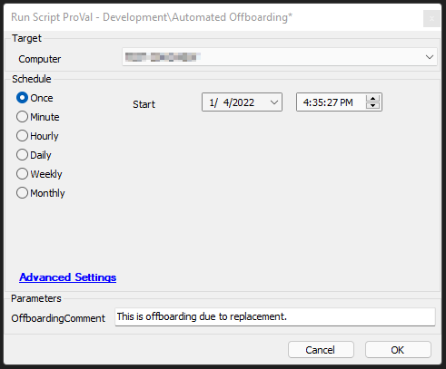

## Summary

The script should be used against an offboarding group, location, monitor Autofix, or run manually. Review and set global values per client standards and products.

It will check if the agent is online or offline; if online, it will attempt the removal of products as set in Globals. If offline, it will just retire the agent.

## Sample Run

#### Global Parameters

| Name                     | Example | Required | Description                                                                                     |
|--------------------------|---------|----------|-------------------------------------------------------------------------------------------------|
| AV_Software_Search       | ESET%   | False    | If filled out, will attempt to remove software. Also requires script line 18 to be set to the correct removal script. |
| ticketcreationcategory    | 123     | False    | If filled out, will enable ticketing for AV and CW Control removal failures.                   |
| ThirdWallRemoval         | 0       | True     | 1 - Will attempt Third Wall removal, 0 - Will NOT attempt removal.                             |
| SCRemoval                | 1       | True     | 1 - Will attempt CW Control removal, 0 - Will NOT attempt removal.                             |
| LTAgentRemoval           | 1       | True     | 1 - Will attempt LT Agent uninstall, 0 - Will NOT attempt removal.                             |
| ContinueOnFailure        | 0       | True     | Cannot be used with ticketing; if set to 1, will force through AV and SC removal failures to continue offboarding. |

#### User Parameters

| Name               | Example                         | Required | Description                                                                                     |
|--------------------|---------------------------------|----------|-------------------------------------------------------------------------------------------------|
| OffboardingComment  | System Replaced - Offboarding   | False    | Comment can be specified to be added to the agent retired comments.                            |

## Process

The script will check if the agent is online or offline; if online, it will attempt the removal of products as set in Globals. If offline, it will just retire the agent.

Windows Updates will be reset back to normal. The script will attempt to remove AV software if specified. It will remove CW Control (ScreenConnect) if specified. Thirdwall will be removed if specified.

Ticketing is optional.

## Output

- Script Log  
- Ticketing on failure if enabled.
## Attachments
[Automated_Offboarding_Generic.xml](<..\..\..\static\attachments\itg\8984816\Automated_Offboarding_Generic.xml>)
