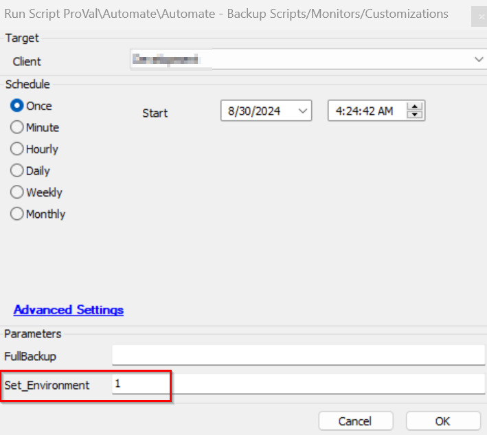
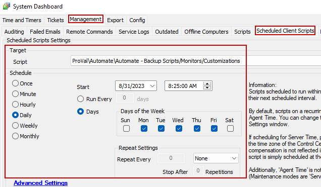

## Summary

This script allows you to export various CW Automate customizations for backup and versioning purposes. The script supports the following types of customizations:

- Scripts
- Scriptlets
- Internal Monitors
- Group Monitors
- Remote Monitors
- Dataviews
- Role Definitions
- ExtraData Fields
- VirusScanners

This is a client script. `AutomateBackup_Computerid`, this property should store the computer ID of the machine where the backup data will be saved. If the computerid is offline or does not exist in Automate then it sends an email to [alerts@provaltech.com](mailto:alerts@provaltech.com) with the details of the problem. This will trigger a high-priority ticket in ProVal’s Autotask system to resolve the issue.

The script will also use another system property called `AutomateBackup_Base_Directory` to determine the destination path for the backup data. If this property is not configured or left blank, the script will default to `C:/CWA Solutions Backup`. If the variable is not correctly defined in the property, it will default to C:/CWAutomate.

By default, the script only backs up or exports the changes made to the customizations. It will export all the contents during the first run and then only the changes made since the last run from the next run. The user can use the `FullBackup` parameter to force a full backup of everything.

Source: [https://forums.mspgeek.org/files/file/17-script-backup/?_fromLogin=1](https://forums.mspgeek.org/files/file/17-script-backup/?_fromLogin=1)

## Update Notice: 1-Aug-2024

- Added a new system property `Backup_Bitlocker_Audit_Data`.
- Setting this property to `1` will enable the backup of the [Bitlocker Status](https://proval.itglue.com/DOC-5078775-8946167) dataview.
- Run the script once against any client with the user parameter `Set_Envionment` set to `1` to create the newly introduced system property.

## Implementations

Step 1: Import the script.  
Step 2: Run the script against any client with the user parameter `Set_Environment` set to 1 after importing the script.  
  

Step 3: Set the relevant values for the system properties `AutomateBackup_Computerid` and `AutomateBackup_Base_Directory`.  
  

Step 4: By Default, the system property `ProVal_Alerts_Email_Address` will get set to [alerts@provaltech.com](mailto:alerts@provaltech.com). This can be changed in the event these alerts should be going somewhere else.  
  

Step 5: Schedule the script to run at regular intervals.  
  

## Dependencies

[CWA - Script - Dataview - Save as CSV [Custom Location]](https://proval.itglue.com/DOC-5078775-14764552)  

## User Parameters

| Name               | Example | Required         | Description                               |
|--------------------|---------|------------------|-------------------------------------------|
| FullBackup         | 1       | False            | 1 to force a full backup.                 |
| Set_Environment     | 1       | For first-run only | 1 to import the required system properties.|

## System Properties

| Name                              | Example                                | Required | Description                                                                                          |
|-----------------------------------|----------------------------------------|----------|------------------------------------------------------------------------------------------------------|
| AutomateBackup_Computerid         | 294                                    | True     | Stores the computer ID of the machine where the backup data will be saved.                          |
| AutomateBackup_Base_Directory     | C:/CWA Solutions Backup                | False    | Stores the destination path for the backup data. The script will default to `C:/CWA Solutions Backup`. If there is a problem with the path in this variable, it will fall back to using 'C:/CWAutomate' |
| ProVal_Alerts_Email_Address        | [Alerts@provaltech.com](mailto:Alerts@provaltech.com) | True     | ProVal's email address to notify of the script's configuration issue. It should be `<code>[Alerts@provaltech.com](mailto:Alerts@provaltech.com)</code>` |
| Backup_Bitlocker_Audit_Data       | 1                                      | False    | Setting this system property to `1` will enable the backup of the `<a href="https://proval.itglue.com/DOC-5078775-8946167"><code>Bitlocker Status</code></a>` dataview. The default value is `1` |

## Script States

Creates a bunch of script states to keep track of each customization. One script state for each Script, Scriptlet, Internal Monitor, Group Monitor, Remote Monitor, Dataview, Role Definition, ExtraData Field, and VirusScanner.

## Output

- Script Log
- Files on Local Computer

