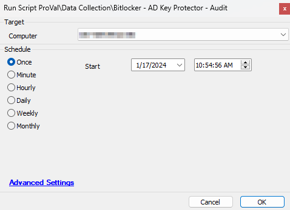
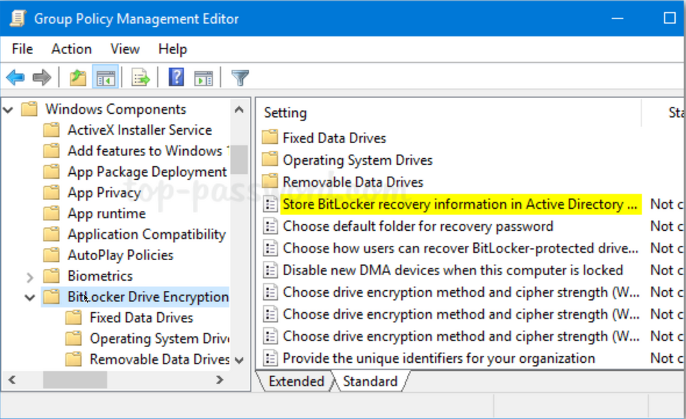
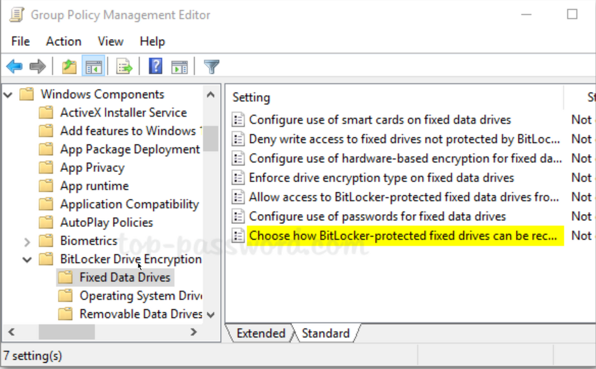
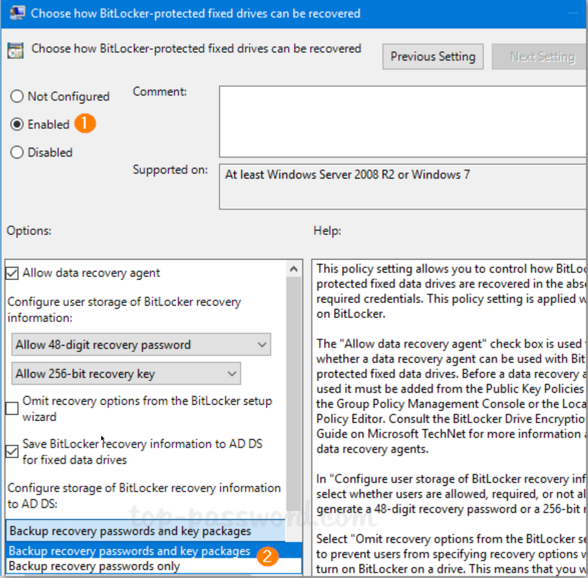

## Summary

Audits the existing backup Bitlocker key protectors from an Active Directory server.

**Note:** **Store BitLocker recovery information in Active Directory Domain Services** policy must be enabled on the domain controller to save the recovery keys.

## Sample Run



## Dependencies

Must be run against an Active Directory server.

[SEC - Encryption - Agnostic - Get-ADBitlockerStores](https://proval.itglue.com/DOC-5078775-9038164)

## Variables

Document the various variables in the script. Delete any section that is not relevant to your script.

| Name        | Description                                                                                                                                                                       |
|-------------|-----------------------------------------------------------------------------------------------------------------------------------------------------------------------------------|
| maxstores   | The number of key protector entries to process in one loop. This is used as a workaround for the Automate variable size limitation of 65000 characters.                         |
| InsertValues| The values to be inserted into the database. This variable will change each iteration of the loop.                                                                               |

## Process

The script implements a looping mechanism to compensate for the character limit of Automate's variables. As such, the `@maxstores@` variable should never be set above 70 to prevent overflow of the variable `@InsertValues@`.

Example:  
The script runs and finds 250 key protectors backed up by Active Directory. The `@maxstores@` variable is set to 70. The following occurs:

```
Loop Iteration 1:
The first 70 records are processed. [0..69]

Loop Iteration 2:
The second 70 records are processed. [70..139]

Loop Iteration 3:
The third 70 records are processed. [139..209]

Loop Iteration 4:
The final 40 records are processed. [210..249]
No additional records are found so another loop iteration is not processed.
```

This causes the underlying PowerShell to be run as many loop iterations as necessary to process all records. The overhead of running this is minimal as the underlying script average execution time is less than 5 seconds.

For additional information about the underlying logic, please see [SEC - Encryption - Agnostic - Get-ADBitlockerStores](https://proval.itglue.com/DOC-5078775-9038164).

## Output

- [SEC - Encryption - Custom Table - plugin_proval_ad_bitlocker_keyprotectors](https://proval.itglue.com/DOC-5078775-9045330)
- Dataview

## GPO to Automatically Save BitLocker Recovery Key to AD

1. Click the Search icon in the taskbar and type “**group policy**“. You can then click **Group Policy Management** to launch it.  
   

2. Now in the left pane of Group Policy Management, right-click your AD domain and select “**Create a GPO in this domain, and Link it here…**” from the menu.  
   

3. In the New GPO dialog, give the GPO a name and click **OK**.  
   

4. Right-click the newly-created GPO in the left pane, and select **Edit**.  
   

5. Browse to `Computer Configuration -> Policies -> Administrative Templates -> Windows Components -> BitLocker Drive Encryption`, and then double-click the policy “**Store BitLocker recovery information in Active Directory Domain Services**“.  
   

6. Set the policy to **Enabled**. Make sure the “**Require BitLocker backup to AD DS**” option is checked, and select to store both recovery passwords and key packages.  
   

7. Next, expand **BitLocker Drive Encryption** in the left pane. You’ll see three nodes: Fixed Data Drives, Operating System Drives, Removable Data Drives. Just select Fixed Data Drives and double-click the policy “**Choose how BitLocker-protected fixed drives can be recovered**“.  
   

8. Set it to **Enabled**. Check the options “Save BitLocker recovery information to AD DS for fixed drives” and then click OK.  
   

9. Go to the “Operating System Drives” node and turn on the similar policy “**Choose how BitLocker-protected operating system drives can be recovered**“. Afterwards, go to the “Removable Data Drives” node and enable the policy “**Choose how BitLocker-protected removable drives can be recovered**“.  

10. When any client PC retrieves the policy changes, BitLocker recovery information will be automatically and silently backed up to AD DS when BitLocker is turned on for fixed drives, OS drives, or removable drives.


