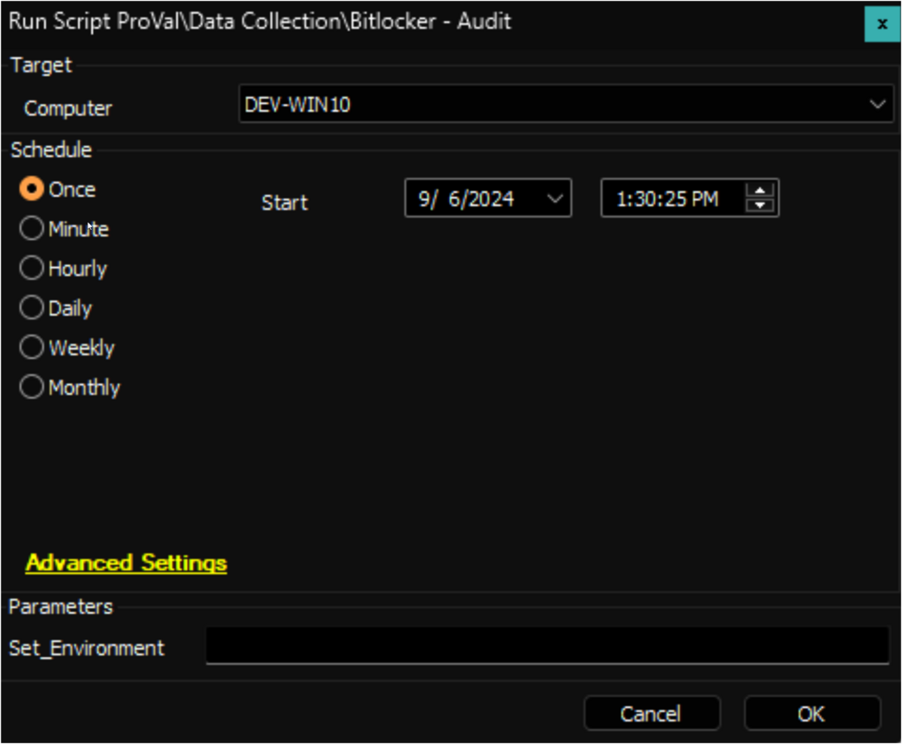

## Summary

Gathers Bitlocker information from the target endpoint and stores it in the custom table [SEC - Encryption - Custom Table - plugin_proval_bitlocker_audit](https://proval.itglue.com/DOC-5078775-8943520). Creates a tpm table named `plugin_proval_tpm_audit` and populates that table with TPM data. Creates a backup text document with the recovery password in the ltshare for the target machine.

**File Path:** `C:/ProgramData/_Automation/Script/Bitlocker_Audit/Bitlocker_Audit.ps1`  
**File Hash (SHA256):** `4C4E524791404130BA61E50C287681010F4D9161766945C36411AEAD23588CFF`  
**File Hash (MD5):** `C8373016D05CE365885AF644F8C9773B`  

**File Path:** `C:/ProgramData/_Automation/Script/Bitlocker_Audit/TPM_Audit.ps1`  
**File Hash (SHA256):** `36BDC7BDE052953BE5DB9324F6E00730C2E0494BC74121BE690CD16117FFF058`  
**File Hash (MD5):** `B332B23E8155ACC256D9737322A7ADF1`  

*Note*: *Bitlocker Drive Encryption Feature must be enabled on Servers to encrypt a drive with Bitlocker disk encryption on it. Encryption will not work without enabling this feature.*

## Sample Run

**First Run:** Run the script against any online windows computer with the `Set_Environment` parameter set to `1` to create the custom tables used by the solution.  

**Regular Execution:**  

## Dependencies

- PowerShell v5
- Bitlocker module for PowerShell

## User Parameters

| Name              | Example | Required                              | Description                                                                                                                                               |
|-------------------|---------|---------------------------------------|-----------------------------------------------------------------------------------------------------------------------------------------------------------|
| Set_Environment    | 1       | For First Run (After Updating the script) | Run the script against any online windows computer with the `Set_Environment` parameter set to `1` to create the custom tables used by the solution. |

## EDFs

| Name                   | Level    | Type   | Editable | Description                                                                                                                |
|------------------------|----------|--------|----------|----------------------------------------------------------------------------------------------------------------------------|
| Bitlocker Recovery Key  | Computer | Text   | No       | This stores the value of the "Recovery Password" of the C: volume whose key protector type is "RecoveryPassword".        |
| Bitlocker Enabled       | Computer | Flag   | No       | This is 'checked' if the protection status of the system drive shows true.                                             |
| TPM Present             | Computer | Flag   | No       | This marks the TPM Present flag if the 'TPM Present' is enabled for the TPM chipset audited by the "Get-TPM".           |

#### Variables

| Name                | Description                                                  |
|---------------------|--------------------------------------------------------------|
| ProjectName         | Bitlocker_Audit                                             |
| WorkingDirectory     | `C:/ProgramData/_automation/script/Bitlocker_Audit`        |
| PsOutBitlocker      | Output of the PowerShell script performing Bitlocker Audit  |
| PsOutTPM            | Output of the PowerShell script performing TPM Audit        |
| Count               | Iteration used for the loop generating Recovery Key Backup File for each drive |
| DriveLetter         | Drive letter with ":" removed from the end                  |
| FilePath            | `C:/ProgramData/_automation/script/Bitlocker_Audit/Bitlocker_Recovery_Key_@DriveLetter@.txt` |
| Content             | The content of the created backup file                       |

## Output

- Custom table
- Dataview
- Backup file under LTshare at "LTShare/Uploads/\<ClientName>/\<ComputerName (Computerid)>"

