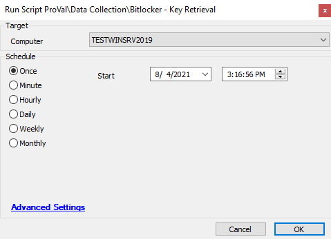

## Summary

This script audits the recovery keys for each encrypted drive on an agent and adds it to a custom table.

Time Saved by Automation: 5 Minutes

## Sample Run

## Dependencies

- @plugin_proval_bitlocker (Table)
- @Bitlocker Enabled (Role)
- @Bitlocker TPM Enabled (Role)
- [Bitlocker TPM Ready](https://proval.itglue.com/DOC-5078775-7970575)
- [Windows - Bitlocker Eligibility](https://proval.itglue.com/DOC-5078775-7960717)

## Variables

- `@PowerShellResult@` -> This is the result showing if Bitlocker is enabled, get the keys, if not return the corresponding information if it can be enabled
- `@sqlletter@` -> SQL dataset cycling returning the Drive letter checked

## Process

1. Creates the required table if not already in the Database
2. Adds the required role definitions for the dataview
3. Queries the target Machine(s) and runs PowerShell to return the Bitlocker key, or the Bitlocker status
4. Writes the key back into the Automate database if it is found encrypted

## Output

- Script log
- Role
- Dataview

