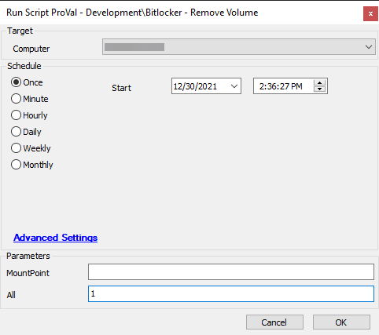
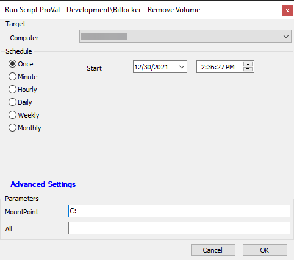

## Summary

Disable BitLocker protection on one (or all) volumes.

## Sample Run

## Dependencies

- [SEC - Encryption - Agnostic - Unprotect-BitLockerVolume](<../../powershell/Unprotect-BitLockerVolume.md>)
- PowerShell v5

### User Parameters

| Name       | Example | Required | Description                                   |
|------------|---------|----------|-----------------------------------------------|
| MountPoint | C:      | Semi     | The volume to unprotect.                     |
| All        | 1       | Semi     | Set to 1 to unprotect all applicable volumes. |

## Process

See process information in the document for [SEC - Encryption - Agnostic - Unprotect-BitLockerVolume](<../../powershell/Unprotect-BitLockerVolume.md>).

## Output

- Script log
- Local file on computer

