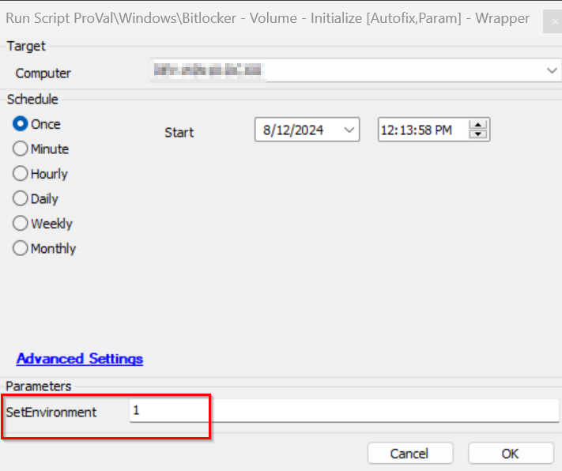

## Summary

This script runs as an autofix to deploy the BitLocker initialization to the agents detected by the monitor [Internal Monitor - Bitlocker - Initialize Volume Deployment](https://proval.itglue.com/DOC-5078775-16773035).

## Sample Run

Run it with `SetEnvironment = 1`, to set the EDFs required for this script once after importing the script.

## Dependencies

- [Internal Monitor - Bitlocker - Initialize Volume Deployment](https://proval.itglue.com/DOC-5078775-16773035)
- [SEC - Encryption - Script - Bitlocker - Volume - Initialize](https://proval.itglue.com/DOC-5078775-8934308)
- [SEC - Encryption - Script - Bitlocker - Audit](https://proval.itglue.com/DOC-5078775-8943478)

#### EDFs

| Name                                              | Level     | Type     | Editable | Description                                                                                                                                                                                                                                                                                                                                         |
|---------------------------------------------------|-----------|----------|----------|-----------------------------------------------------------------------------------------------------------------------------------------------------------------------------------------------------------------------------------------------------------------------------------------------------------------------------------------------------|
| BitLocker Encryption Automation - Enable [Wks]    | Location  | Dropdown | Yes      | This location EDF provided two options: AllDrives - Select this to enable the initialization of BitLocker to all NTFS, internal, and nonmissing drives. SystemDrive - Select this to enable the initialization of BitLocker to (C:) volume.                                                                                             |
| Bitlocker Enable Exclude                           | Computer  | Flag     | Yes      | This computer EDF if checked will exclude the agent from the BitLocker auto-initialization.                                                                                                                                                                                                                                                        |

#### User Parameters

| Name            | Example | Required | Description                                                                                                                                                                     |
|-----------------|---------|----------|---------------------------------------------------------------------------------------------------------------------------------------------------------------------------------|
| SetEnvironment   | 1 or 0 | False    | Executing the script for the first time with SetEnvironment = 1 is mandatory to set the EDFs in the partner environment.                                                     |

## ScriptState

| Variable Name                     | Value    | Required | Description                                                                                                                                                                                                                     |
|-----------------------------------|----------|----------|---------------------------------------------------------------------------------------------------------------------------------------------------------------------------------------------------------------------------------|
| Bitlocker_Enable_Fail_Count       | 1 or 2  | True     | The script enters the count of failed attempts of the BitLocker initialization to this script state. If it fails twice (2) times, the computer will be excluded from the monitor [Internal Monitor - Bitlocker - Initialize Volume Deployment](https://proval.itglue.com/DOC-5078775-16773035). |

## Output

- Script log
- Dataview

