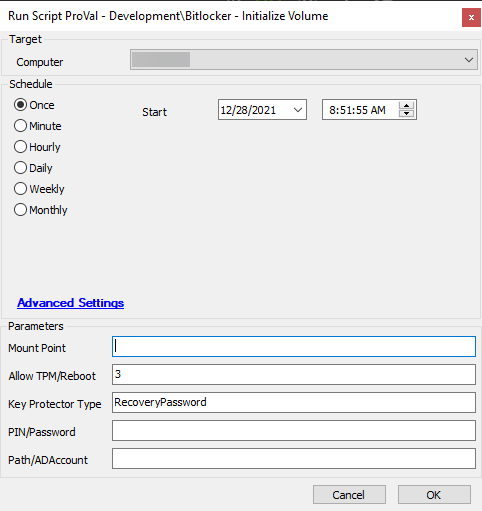
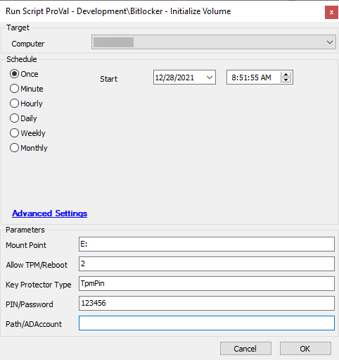

## Summary

Encrypts a drive with Bitlocker disk encryption.

*Note*: *The Bitlocker Drive Encryption feature must be enabled on servers to encrypt a drive with Bitlocker disk encryption. Encryption will not work without enabling this feature.*

## Sample Run

Encrypts the system drive of the target system with a Recovery Password, allowing TPM to be initialized if needed and rebooting if necessary.

Encrypts the E: volume of the target system with a TPM+PIN combination, allowing a reboot if necessary.

## Dependencies

- [SEC - Encryption - Agnostic - Initialize-BitLockerVolume](<../../powershell/Initialize-BitLockerVolume.md>)
- PowerShell v5

#### Global Parameters

| Name                | Example  | Required | Description                                                                                                          |
|---------------------|----------|----------|----------------------------------------------------------------------------------------------------------------------|
| Encryption Method    | Aes128   | True     | The encryption method that will be used to protect the target volume. Valid options are:                            |
|                     |          |          | - Aes128                                                                                                           |
|                     |          |          | - Aes256                                                                                                           |
|                     |          |          | - XtsAes128                                                                                                        |
|                     |          |          | - XtsAes256                                                                                                        |

#### User Parameters

| Name                | Example                         | Required | Description                                                                                                          |
|---------------------|---------------------------------|----------|----------------------------------------------------------------------------------------------------------------------|
| Mount Point          | E:                              | False    | The volume to protect. Defaults to the system drive.                                                                |
| Allow TPM/Reboot     | 3                               | False    | Options for allowing TPM initialization and rebooting.                                                               |
|                     |                                 |          | 0 = Do not allow                                                                                                    |
|                     |                                 |          | 1 = Allow TPM Initialization                                                                                         |
|                     |                                 |          | 2 = Allow Reboot                                                                                                    |
|                     |                                 |          | 3 = Allow TPM Initialization and Reboot                                                                             |
| Key Protector Type   | RecoveryPassword                | True     | Options for which type of protector to use for Bitlocker:                                                           |
|                     |                                 |          | - Tpm                                                                                                              |
|                     |                                 |          | - TpmPin (Requires PIN/Password parameter)                                                                          |
|                     |                                 |          | - TpmStartup (Requires Path/ADAccount parameter)                                                                    |
|                     |                                 |          | - TpmPinStartup (Requires PIN/Password and Path/ADAccount parameters)                                              |
|                     |                                 |          | - Password (Requires PIN/Password parameter)                                                                        |
|                     |                                 |          | - Startup (Requires Path/ADAccount parameter)                                                                       |
|                     |                                 |          | - RecoveryKey (Requires Path/ADAccount parameter)                                                                   |
|                     |                                 |          | - RecoveryPassword                                                                                                   |
|                     |                                 |          | - AdAccount (Requires Path/ADAccount parameter)                                                                    |
| PIN/Password         | - 123456                        | Semi     | Option for the PIN or Password needed for specific key protector types.                                             |
|                     | - Pa$sw0rD!                    |          |                                                                                                                      |
|                     | - 123456-654321-123456-654321-123456-654321 |          |                                                                                                                      |
| Path/ADAccount       | - F:/Recovery                   | Semi     | Option for the Path or AD Account needed for specific key protector types.                                          |
|                     | - CONTOSO/ContosoUser          |          |                                                                                                                      |
|                     | - CONTOSO/ContosoGroup         |          |                                                                                                                      |

## Process

See detailed process information in the document for [SEC - Encryption - Agnostic - Initialize-BitLockerVolume](<../../powershell/Initialize-BitLockerVolume.md>).

When running the script, you must select a key protector type. Here is a brief explanation of each of them:

| Name               | Description                                                                                                           |
|---------------------|----------------------------------------------------------------------------------------------------------------------|
| Tpm                 | Protect the encrypted drive with only the TPM chip.                                                                  |
| TpmPin              | Protect the encrypted drive with the TPM chip and a PIN. Requires the PIN/Password parameter to be passed.          |
| TpmStartup          | Protect the encrypted drive with the TPM chip and a startup key. Requires the Path/ADAccount parameter to be passed. |
| TpmPinStartup       | Protect the encrypted drive with the TPM chip, a PIN, and a startup key. Requires the PIN/Password and Path/ADAccount parameters to be passed. |
| Password            | Protects the encrypted drive with a custom password. Requires the PIN/Password parameter to be passed.              |
| Startup             | Protect the encrypted drive with a startup key. Requires the Path/ADAccount parameter to be passed.                 |
| RecoveryKey         | Protect the encrypted drive with a recovery key. Requires the Path/ADAccount parameter to be passed.                |
| RecoveryPassword    | Protect the encrypted drive with a recovery password. If the PIN/Password parameter is not passed, then the script will generate one automatically. |
| AdAccount           | Protect the encrypted drive with an Active Directory Account or Group. Requires the Path/ADAccount parameter to be passed. |

## Output

- Script log
- Local file on computer

