## Summary

This script serves as a wrapper for configuring the homepage of three browsers: Google Chrome, Microsoft Edge, and Mozilla Firefox. It leverages the following scripts:

- [EPM - Software Configuration - Chromium Browsers - Homepage - Set](https://proval.itglue.com/DOC-5078775-14985330)
- [EPM - Software Configuration - Chromium Browsers - Homepage - Remove](https://proval.itglue.com/DOC-5078775-14985325)
- [EPM - Software Configuration - Script - Mozilla Firefox - Homepage - Set](https://proval.itglue.com/DOC-5078775-14894150)
- [EPM - Software Configuration - Script - Mozilla Firefox - Homepage - Remove](https://proval.itglue.com/DOC-5078775-14894153)

The 'Action' parameter can be used to specify the desired action (Set/Remove/Replace), and the 'Browser' parameter to indicate the target browser for the operation. If the 'Browser' parameter is left unspecified, the script will perform the specified action on all three browsers.

## Dependencies

Importing this script will import the following scripts too:

- [EPM - Software Configuration - Chromium Browsers - Homepage - Set](https://proval.itglue.com/DOC-5078775-14985330)
- [EPM - Software Configuration - Chromium Browsers - Homepage - Remove](https://proval.itglue.com/DOC-5078775-14985325)
- [EPM - Software Configuration - Script - Mozilla Firefox - Homepage - Set](https://proval.itglue.com/DOC-5078775-14894150)
- [EPM - Software Configuration - Script - Mozilla Firefox - Homepage - Remove](https://proval.itglue.com/DOC-5078775-14894153)

## User Parameters

| Name                       | Example                               | Required | Description                                                                                                                                                                                                 |
|----------------------------|---------------------------------------|----------|-------------------------------------------------------------------------------------------------------------------------------------------------------------------------------------------------------------|
| Action                     | Set                                   | True     | The 'Action' parameter can be used to specify the desired action (Set/Remove). <ul><li>Set -> To set the Homepage</li><li>Remove -> To Remove the Homepage</li><li>Replace -> To Replace the current Homepage <ul><li>Use this to override previously configured settings (such as EnforceOnNewTab)</li></ul></li></ul> |
| Browser                    | Chrome                                | False    | The 'Browser' parameter specifies the browser for setting/removing the homepage. Only 'Chrome', 'Edge', and 'Firefox' are acceptable values. If unspecified, the script will perform the action on all three browsers. Each value should be separated by a comma without any additional spaces. e.g., chrome,firefox |
| Homepage                   | [https://www.provaltech.com](https://www.provaltech.com) | True     | The string value of the homepage to set in the browser. Only useful with the `Set` and `Replace` actions.                                                                                                 |
| EnforceOnNewTab           | 1                                     | False    | Set to 1 to force the homepage on each new tab instead of the new tab page. Only useful with the `Set` and `Replace` actions and only works on Chromium Browsers (Chrome and Edge).                       |
| EnforceHomepageStartup     | 1                                     | False    | Set to 1 to force the homepage to be the only open tab at the startup of the browser. Only useful with the `Set` and `Replace` actions.                                                                   |

## Action

### Set:
Set action can be used for setting a specific homepage to the concerned browser(s).

**Parameters Used:**  
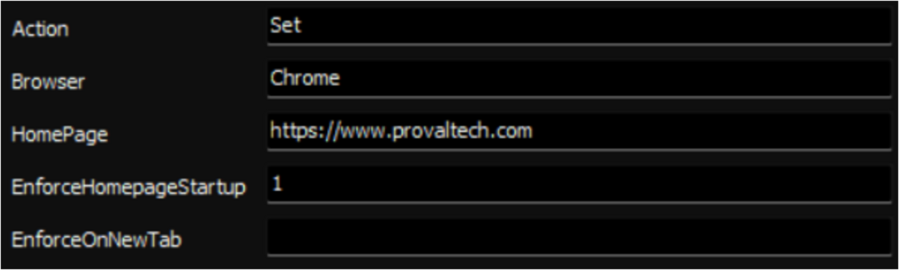

**Output:**  

### Remove:
Remove action can be used to remove the currently applied Homepage from the concerned browser(s).

**Parameters Used:**  
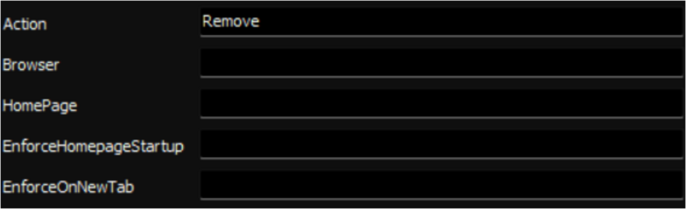

**Output:**  
**Google Chrome:**  
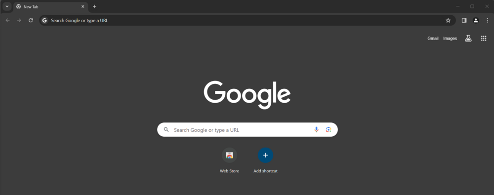  
**Mozilla Firefox:**  
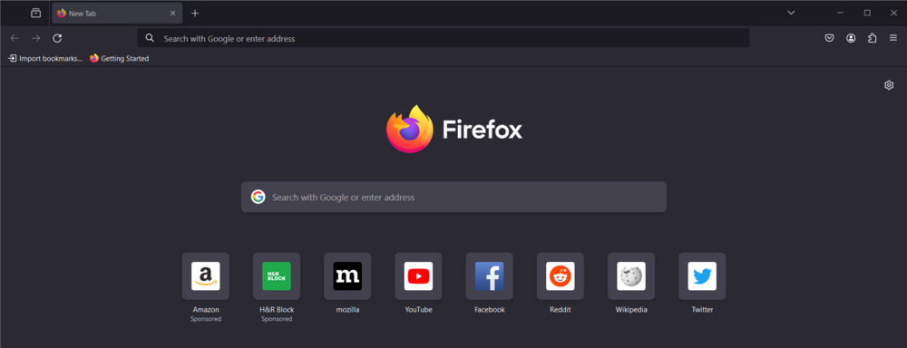  
**Microsoft Edge:**  
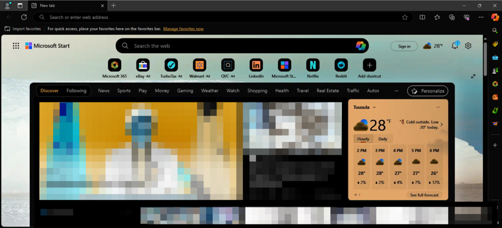

### Replace:
The `Replace` action serves to substitute the existing homepage configuration in the specified browser(s) with a new one. This functionality proves useful when you intend to replace the current homepage with an alternative one. Another scenario where this action is beneficial is when a homepage has been erroneously configured with the `EnforceOnNewTab` option. In such cases, users can rectify the error by employing the `Replace` action in the script, leaving the `EnforceOnNewTab` parameter empty. This ensures a seamless correction of the previous misconfiguration.

**Parameters Used:**  
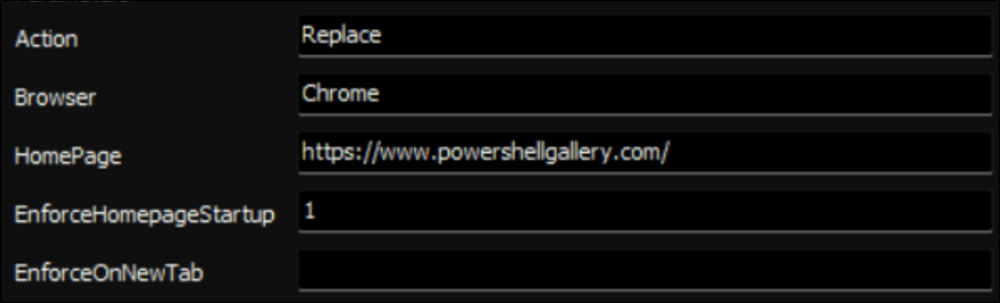

**Output:**  
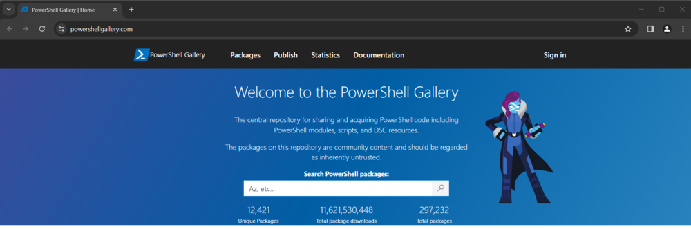

## Sample Run

- Set the Homepage on a single browser.  
Example: Setting [https://www.provaltech.com](https://www.provaltech.com) to the homepage of Google Chrome:  
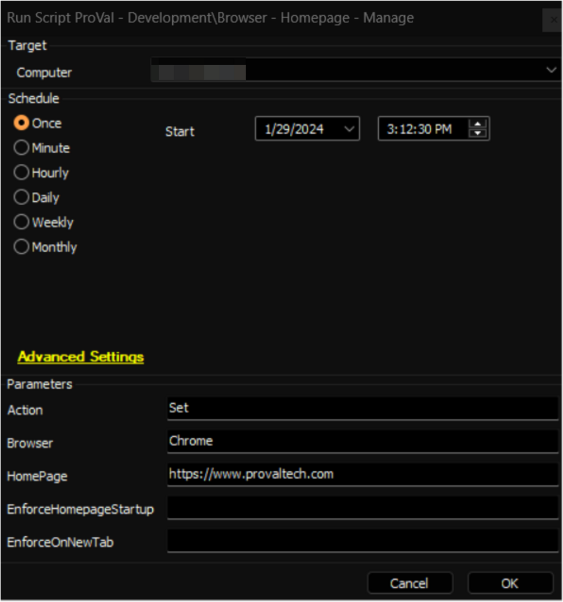

- Remove the Homepage from one single browser:  
Example: Removing the homepage from Mozilla Firefox:  
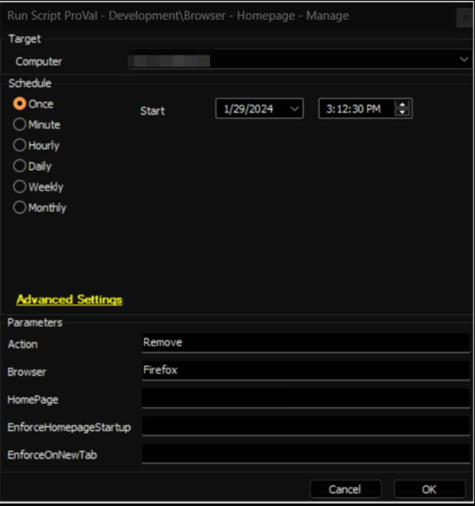

- Replace the current homepage on a single browser.  
Example: Replacing the homepage on Microsoft Edge with [https://www.provaltech.com](https://www.provaltech.com):  
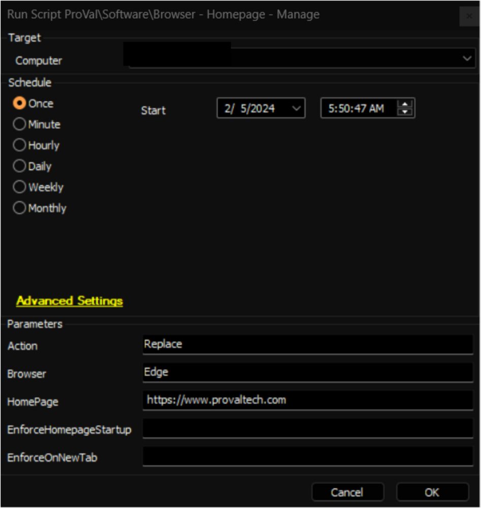

- Perform an action against multiple browsers:  
Example: Replacing the homepage with [https://www.provaltech.com](https://www.provaltech.com) for Google Chrome and Mozilla Firefox:  
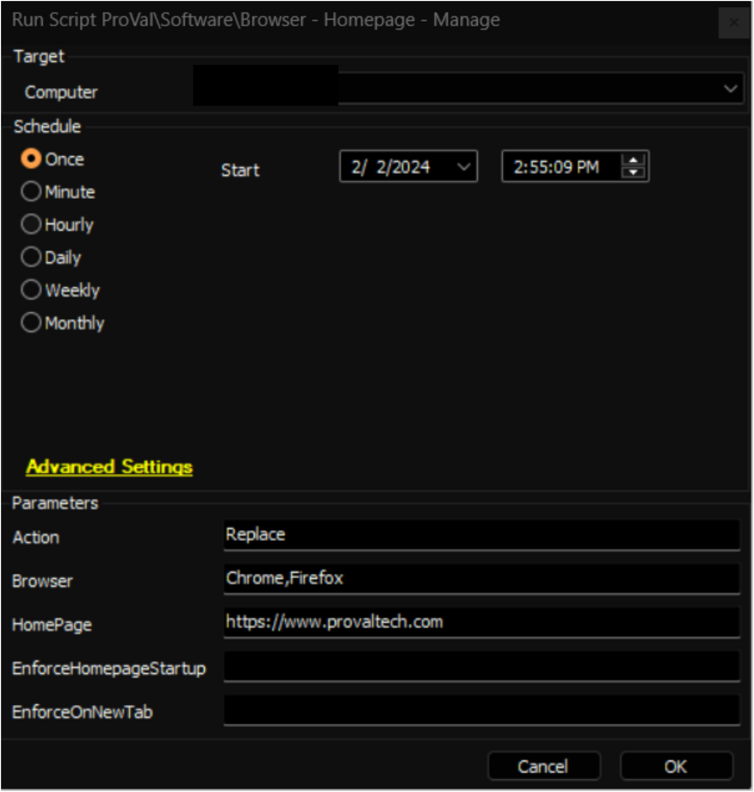

- Perform an action against all browsers:  
Example: Removing the homepage from all three browsers (Google Chrome, Microsoft Edge, Mozilla Firefox):  

- Enforce the homepage on Browser startup.  
Example: Configuring Google Chrome and Microsoft Edge to open [https://www.provaltech.com](https://www.provaltech.com) as the homepage upon startup and ensuring that this setting is enforced in both browsers.  
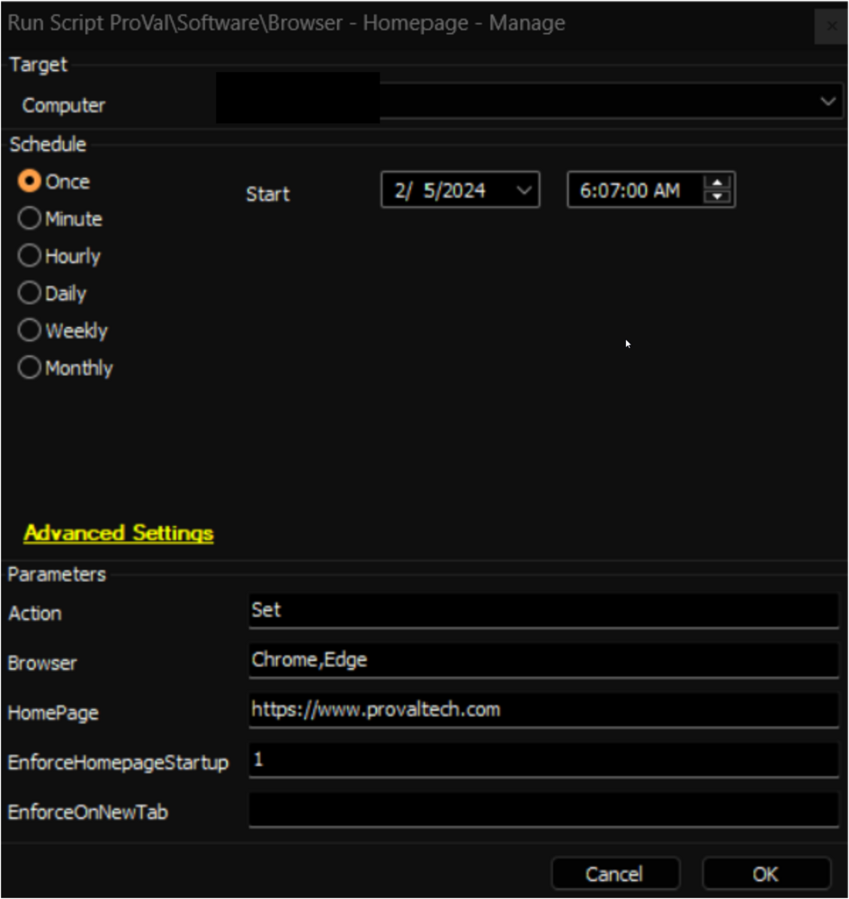

## Output

- Script logs

