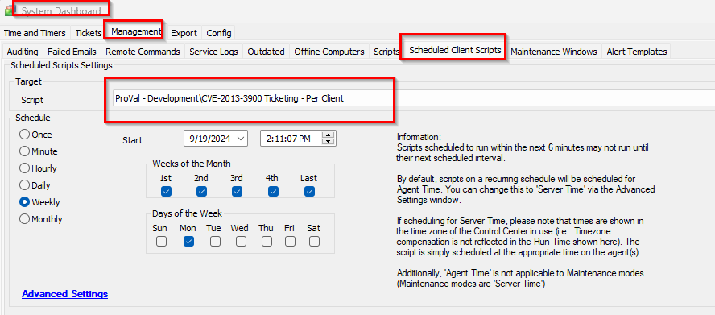

## Summary

This client script creates a ticket for each client with the computer count where remediation is required.

## Sample Run

## Dependencies

[Script - CVE-2013-3900 WinVerifyTrust Signature Vulnerability](<./CVE-2013-3900 WinVerifyTrust Signature Vulnerability.md>)

## Variables

| Name                   | Description                                                                                                                                                                          |
|------------------------|--------------------------------------------------------------------------------------------------------------------------------------------------------------------------------------|
| VulnerableagentCount   | This stores the count of computers where remediation is required, marked by the script [Script - CVE-2013-3900 WinVerifyTrust Signature Vulnerability](<./CVE-2013-3900 WinVerifyTrust Signature Vulnerability.md>). |
| TicID                  | It stores the ticket ID if any existing open ticket is detected, allowing for comments to be made on the same ticket.                                                            |

## Output

- Ticket

## Ticketing

1. Ticketing:
   
   **Subject**:  
   The CVE-2013-3900 WinVerifyTrust Signature Vulnerability was detected on the client: @sqlname@.  
   Here, @sqlname@ is the name of the client.

   **Body**:  
   The CVE-2013-3900 WinVerifyTrust Signature Vulnerability was detected on the @VulnerableagentCount@ computer of client "@sqlname@".  
   Please review the dataview for the computer list.  

   OR  

   The CVE-2013-3900 WinVerifyTrust Signature Vulnerability was detected on @VulnerableagentCount@ computers of client "@sqlname@".  
   Please review the dataview for the computer list.
