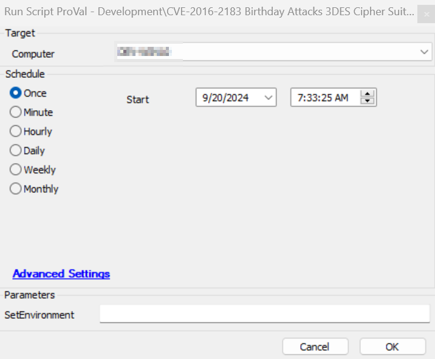
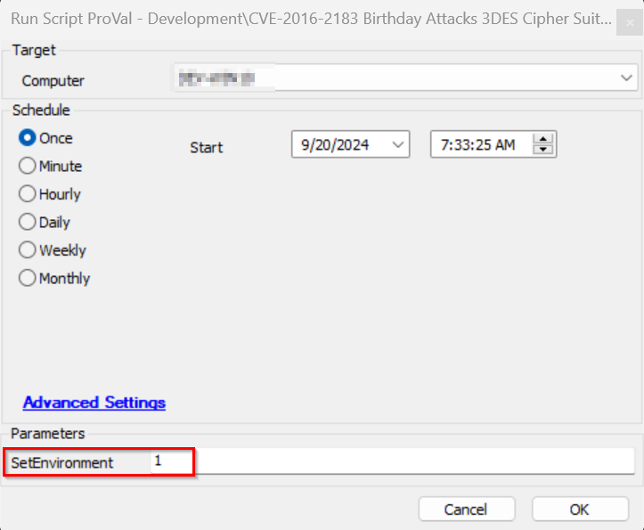
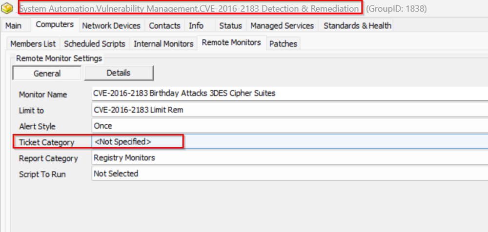

## Summary

This script was created to run the detection/remediation for CVE-2016-2183 Birthday Attacks 3DES Cipher Suites Vulnerability detection and remediation based on the EDFs option selected by the agent.

## Sample Run

It is required to execute this script after importing with setting the SetEnvironment = 1,

## Dependencies

[CWA Remote Monitor - CVE-2016-2183 Birthday Attacks 3DES Cipher Suites](https://proval.itglue.com/DOC-5078775-15762067)

## Variables

| Name                          | Description                                                                                                                                                                                                                                   |
|-------------------------------|-----------------------------------------------------------------------------------------------------------------------------------------------------------------------------------------------------------------------------------------------|
| DetectionOnly                 | This collects client-EDF 'CVE Vulnerability Detection Only' data for the agent where the script is deployed. If it is 1, then the CVE-2016-2183-only detection will run and register to the dataview without remediation.                      |
| Detection-Remediation         | This collects data from client-EDF "CVE-2016-2183 Vul Detection and Remediation" for the agent where the script is deployed. If it is 1, then the CVE-2016-2183 vulnerability will be detected, if found vulnerable then attempt to remediate it and log the result to the dataview. |
| RemediationStatusCheck        | This contains a report on whether the remediation was successful or not.                                                                                                                                                                   |
| psout                         | It contains the complete output of the PowerShell execution for the CVE detection/remediation action.                                                                                                                                       |
| TicketCreation                | It contains the ticket categoryID applied on the [CWA Remote Monitor - CVE-2016-2183 Birthday Attacks 3DES Cipher Suites](https://proval.itglue.com/DOC-5078775-15762067). Only the ticket will be created if the category is set.         |

#### EDFs

| Name                                             | Level       | Type  | Example                      | Description                                                                                      |
|--------------------------------------------------|-------------|-------|------------------------------|--------------------------------------------------------------------------------------------------|
| CVE-2016-2183 Status                             | Computer    | Text  | Remediation Successful       | This stores the status of CVE-2016-2183 status after script execution                          |
| CVE-2016-2183 Logging                            | Computer    | Text  | @psout@                     | This stores the script PowerShell execution output for logging                                   |
| CVE-2016-2183 Detection Date                     | Computer    | Text  | 2024-05-01 00:00:00        | This stores the date and time when the last CVE-2016-2183 status was detected via the script    |
| CVE-2016-2183 Vulnerability                      | Computer    | Text  | Not Vulnerable              | This shows whether the device is vulnerable or not vulnerable based on the script output detection |
| CVE-2016-2183 Vul Detection and Remediation      | Client      | Flag  | 1                            | If this client EDF is checked, then the CVE-2016-2183 detection, as well as remediation, will be performed by the script as the client will be added to the group "CVE-2016-2183 Detection & Remediation". |
| CVE Vulnerability Detection Only                 | Client      | Flag  | 1                            | If this client EDF is checked, then the CVE-2016-2183 detection only will be performed by the script as the agents will be added to the group "CVE Vulnerability Detection Only". |
| CVE-2016-2183 Vul Detection and Remediation Exclude | Location    | Flag  | 0                            | If this location EDF is checked, then the CVE-2016-2183 detection & remediation will be excluded from all agents of the location. |
| CVE-2016-2183 Vul Detection and Remediation Exclude | Computer    | Flag  | 0                            | If this EDF is checked, then the CVE-2016-2183 detection & remediation will be excluded from the agent. |
| CVE-2016-2183 Vul Detection and Remediation      | Computer    | Flag  | 1                            | If this EDF is checked, then the agent will added to the group "CVE-2016-2183 Detection & Remediation". |

## Output

- Script log
- Dataview

## Ticketing

1. How to Enable Ticket:
   - Navigate to the group 'CVE-2016-2115 - SMB Signing' > Open group > Go to Computers > Remote Monitors.
   - Select the remote monitor [CWA Remote Monitor - CVE-2016-2183 Birthday Attacks 3DES Cipher Suites](https://proval.itglue.com/DOC-5078775-15762067) and check the ticket category  
   

   - If this ticket category is set, then only the script will be able to create a ticket for the remediation step.  
     **Failure:**  
     **Subject:**  
     CVE-2016-2183 Birthday Attacks 3DES Cipher Suites Vulnerability is Detected on %ComputerName%  
     **Body:**  
     @TicketComment@  
     The remediation was attempted for the vulnerability fix on the computername %computername% but it failed. Refer to the logs:  
     @psout@  
     OR  
     The remediation PowerShell execution has failed. Refer to the below logs:  
     @psout@  
     **Success:**  
     **Body:**  
     The remediation PowerShell was executed successfully. Refer to the below logs:  
     @psout@  
     OR  
     NO 3DES Cipher Suites Detected. Refer to the below logs:  
     @psout@

