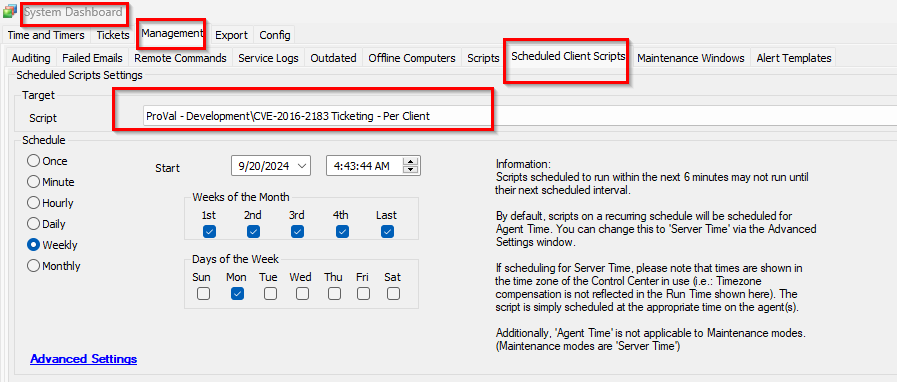

## Summary

This client script creates a ticket for each client with the computer count where remediation is required.

## Sample Run

## Dependencies

@Script - CVE-2016-2183 Birthday Attacks 3DES Cipher Suites Remediation [Param]

## Variables

| Name                   | Description                                                                                                                                           |
|------------------------|-------------------------------------------------------------------------------------------------------------------------------------------------------|
| VulnerableagentCount   | This stores the count of computers where the remediation is required marked by the script @Script - CVE-2016-2183 Birthday Attacks 3DES Cipher Suites Remediation [Param]. |
| TicID                  | It stores the ticket ID if there is any existing open ticket detected so that commenting can be done on the same ticket.                           |

## Output

- Ticket

## Ticketing

1. Ticketing:
   - **Subject**:  
     The CVE-2016-2183 Birthday Attacks 3DES Cipher Suites Vulnerability detected on the client: `@sqlname@`  
     Here, `@sqlname@` is the client's name.
   
   - **Body**:  
     The CVE-2016-2183 Birthday Attacks 3DES Cipher Suites Vulnerability detected on the `@VulnerableagentCount@` computer of the client `"@sqlname@"`.  
     Please review the dataview for the computer list.  
     OR  
     The CVE-2016-2183 Birthday Attacks 3DES Cipher Suites Vulnerability detected on the `@VulnerableagentCount@` computers of the client `"@sqlname@"`.  
     Please review the dataview for the computer list.

