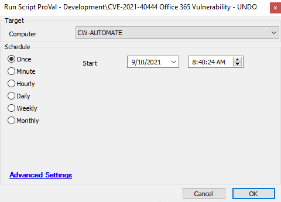

## Summary

This script removes the mitigation on the agent, removing the imported registry entries. Refer to the below article:

[https://www.bleepingcomputer.com/news/security/microsoft-shares-temp-fix-for-ongoing-office-365-zero-day-attacks/amp/?__twitter_impression=true](https://www.bleepingcomputer.com/news/security/microsoft-shares-temp-fix-for-ongoing-office-365-zero-day-attacks/amp/?__twitter_impression=true)

Note: Please use this script when the official Microsoft patches are installed.

Time Saved by Automation: 10 Minutes

## Sample Run

## Dependencies

[CVE-2021-40444 Office 365 Vulnerability Report](https://proval.itglue.com/DOC-5078775-8233524)

## Variables

| Variable         | Description                                                  |
|-------------------|--------------------------------------------------------------|
| scriptcount       | Tracks the record of how many attempts the script has made to reboot the agent. |
| MitigationStatus   | Shows the status of the Mitigation steps.                   |
| ScriptRanDate      | The last time the script ran.                               |
| ApprovedStatus     | It stores the reboot approved status                        |

#### Script States

| Name                          | Example                                   | Description                                                                                  |
|-------------------------------|-------------------------------------------|----------------------------------------------------------------------------------------------|
| CVE-2021-40444_Office365      | 0 -- 12/09/2021 -- No User -- Mitigation Applied | Tracks information needed by dataviews and monitors about the script execution and results. |

## Process

- This script will download and execute the enable-activex.reg registry file from: [http://download.bleepingcomputer.com/reg/enable-activex.reg](http://download.bleepingcomputer.com/reg/enable-activex.reg)
  - The registry file deletes the previously entered registry entries from the endpoint.
- The script validates if the registry execution completed successfully.
- Data is written to the script state.

## Output

- Script log
- Script state
- Dataview

