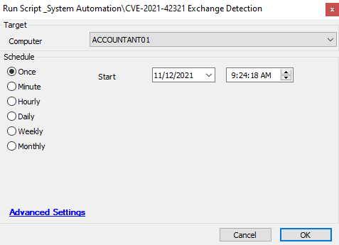

## Summary

This script detects whether the Exchange server has been impacted with CVE-2021-42321 or not. If the vulnerability is detected, then this script will generate a ticket.

## Sample Run

#### Global Parameters

| Name            | Example | Required | Description                                                                                      |
|-----------------|---------|----------|--------------------------------------------------------------------------------------------------|
| TicketCreation   | 1       | True     | 1 -- Will create ticket if found vulnerable0 -- Will not create any ticket                   |

## Process

This script will check for the event generated for the CVE impact as per the article:  
[Released November 2021 Exchange Server Security Updates](https://techcommunity.microsoft.com/t5/exchange-team-blog/released-november-2021-exchange-server-security-updates/ba-p/2933169)

Please install the Nov, 9 2021 Exchange Security patches for mitigation of this vulnerability.

## Output

- Script log
- Ticket

